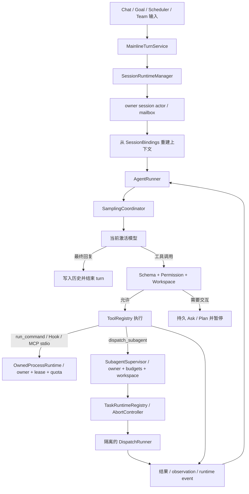

# Agent 执行链路

> 文档状态：Active<br>
> 面向读者：维护者、Agent runtime 开发者<br>
> 最后核验：2026-07-21<br>
> 事实源：`packages/core/src/agent/`、`packages/core/src/api/services/`、`packages/core/src/runtime/`、`packages/core/src/sessions/`、`desktop/src/renderer/src/composables/useRuntime.ts`

本文记录当前 TypeScript / Electron 主线的一次 Agent turn 如何进入 Core、构建上下文、调用模型、执行工具并持久化。旧 Python CLI、Web backend 和 HTTP / WebSocket fallback 不属于当前产品链路。

## 主链路



所有入口复用主线 turn 服务。`source` 用于区分 chat、goal、scheduler 等来源，但不会选择另一套权限系统。

模型一次返回多个工具调用时，Runner 使用两阶段边界：第一阶段对整批做 schema normalize、Guard、Hook 转换、workspace containment 和 Permission 预检，不执行工具；第二阶段只在整批允许后交给 `ToolExecutionEngine`。需要权限时，所有精确操作合并为一张卡并暂停，批准恢复后通过私有 request ID 原子消费；Hook `allow` 不能绕过 Core Ask。任何预检错误或 deny 都阻止本批其他副作用。

## Per-session runtime actor

`SessionRuntimeManager` 按 session ID 定位 actor。每个 actor 独占一组 `SessionBindings`：`ConversationStore`、session memory、runtime event store、history、Todo、Skill scope、ContextBuilder 和主 Runner。`activeSession` 只表示当前桌面 UI 所选会话；正在运行的 turn 始终使用启动时捕获的 bindings，不会因用户切换侧栏而改写执行归属。

同一 session 的命令进入串行 mailbox，command ID 重复时复用第一次 receipt；不同 session 的 actor 可以并行运行。turn command ID 由本轮 `turnId` 派生，和长生命周期 owner `taskId` 分离：例如同一个 `goal:<id>` 的多个 continuation cycle 必须各自执行，但同一 `turnId` 的重试只消费一次。当前迁移阶段最多同时保留 2 个 actor：容量满时只淘汰最久未使用的 idle actor；两个 actor 都有运行或排队命令时 fail closed，不创建无限后台并发。Actor 被淘汰、session 关闭或进程重启后，从既有 session store 重建 bindings，不把内存对象当作持久真相。

普通 turn 的 busy/cancel/replay 按 session 归属判断。取消 session A 只中止 A 的 signal 和 mailbox command，不取消 B；同一 session 的下一条命令要等前一条进入 terminal 后才执行。Goal 仍保留全局 mutation owner，Goal 运行时普通 turn 不并发进入，避免在后续专门迁移 Goal 所有权前破坏 Completion Gate。当前 actor 数量、running/queued、receipt 数量和非法状态迁移计数可在 Diagnostics 的 `sessionRuntimes` 查看。

每个 actor 的内部 command mailbox 仍以 64 条作为防失控安全上限；面向用户的聊天 prompt queue 另有更严格的每 session 单槽限制。同一 session 已存在尚未开始的 queued/interject prompt 时，新增 busy prompt 在写 message graph 或 runtime event 前返回 `prompt_queue_full`（`capacity=1`），不会创建用户气泡或影响首项；不同 session 的槽互不影响。取消或正式 dequeue 后槽立即释放。升级前已经持久化的多条旧队列不会被删除，Core 会按 FIFO 排空，排空期间拒绝新增。

忙碌 session 在单槽空闲时按 Enter 默认 `queue`，等待当前 command 收口后启动新 turn；文字、附件、Skill 与 MCP 引用都可排队。用户可从 Composer 顶部的队列栏把仍未开始且支持插话的项原子替换成 `interject`，绑定当前 running command，并只在 runner 的模型请求前或模型响应后、工具执行前的安全边界消费。Actor 在替换前同时确认旧项仍 queued 且 owner turn 仍 running；竞态失败时保留原队列项。取消与替换事件幂等，旧项不会丢失或执行两次。附件和显式 Skill 请求不走 interject；已展开为文字上下文的 MCP inline token 可以插话。

Prompt mailbox 的可恢复事实写入 session message graph。普通取消先把 graph 状态提交为 `cancelled`，再中止 actor 中尚未开始的 command；queued→interject 替换则在 actor 的比较交换边界内用单条 `prompt_replaced` graph 事件同时取消旧项并创建替代项，不存在只完成一半的双写窗口。启动恢复时，`queued` 按原创建顺序重新入队；遗留 `running` 若尚无持久 `user_message`，会生成确定性替代 ID 并重新排队，已有 `user_message` 则只标记中断而不重放；遗留 `interjected` 已有用户历史时补齐为 completed，没有历史时改为独立恢复队列项。这样在进程退出边界上优先保证消息不丢，并避免已进入历史的 prompt 再执行一次。

Interject 到达模型/工具边界后，旧 response 与尚未执行的旧 tool call 被作废，已流出的 assistant partial 写入 message graph tombstone，并产生 `message_tombstoned` 投影；随后把插话作为新的 user message 进入下一次模型请求。用户取消 owner turn 时，尚未消费的 interjection 转为 `cancelled`，普通 mailbox 中下一条独立 queue command 保留。模型失败或 signal 取消发生在 partial 之后时也执行同一 tombstone 收口，不能把孤儿 partial 提交为有效历史。

## 模型采样与单一重试预算

每个 session runner 持有一个 `SamplingCoordinator`。Runner 只提交一次逻辑 request；coordinator 生成稳定 `requestId` 和逐次 `attemptId`，拥有最多 3 次 foreground attempt、90 秒总 deadline、Retry-After、指数退避与有界 jitter，并让 parent `AbortSignal` 同时中止 provider stream 和 retry sleep。认证、schema、权限、context、429、5xx、transport、doom、content-filter 分开分类；只有 429、5xx 和 transport 默认可重试，context 仍交给现有 emergency context shrink，不暗中切换模型。

OpenAI 与 Anthropic SDK 的内建 retry 均设为 0，避免和 Core 合成不可解释的双层预算。OpenAI-compatible 的 `stream_options` 能力协商也不在 provider 内部二次提交：provider 只更新请求能力，下一次提交仍由 coordinator 记为新的 attempt。每次 attempt 恰有 `model_attempt_started` 和一个 succeeded / failed / cancelled terminal 事件；这些事件强制以 `EventEnvelopeV2`、`visibility=diagnostic` 写入 owner session，包含 request/attempt correlation 和幂等键，不进入模型 history。

## 显式模型回退与成本策略

`model_config.json` 的可选 `policy` 由 `ModelRouter` 随 route 物化，但默认不存在有效 fallback，也没有成本上限。只有用户保存 `fallback.enabled=true` 和一个非 active `entryId` 后，`ModelCaller` 才会在 SamplingCoordinator 已耗尽当前模型后检查 `rate_limit` / `transient` trigger；auth、schema、permission、context、doom/billing、content-filter 和 unknown 都不会切换。跨模型 transition 每个 Agent step 最多一次，fallback 在该 step 的后续工具循环中保持，step 收口后 runner state 重置为 primary。

启用 fallback 时，模型 delta 先进入 16 MiB / 20,000 event 的 provisional staging，Sampling attempt/retry 诊断仍实时发出。模型成功后按序 flush；失败路径的 staged delta 被丢弃。流式 tool-complete callback 同时关闭，避免旧模型的 provisional tool ID 在 fallback 前产生副作用；成功响应仍走正常批式工具执行。发给 fallback 的 provider projection 会移除 `reasoning_content`、reasoning/thinking/signature/redacted/encrypted/`extra_content` 等模型绑定字段，但 canonical history、message graph 和 checkpoint 不被改写。

每条模型可选保存四类 USD / million-token `pricing`。计费内部使用整数 nano-USD；未知价格保持 incomplete，不推断免费。`maxUsdPerAgentTurn` 启用时要求 active 和显式 fallback 都有完整价格，请求前按估计输入、最贵的 input/cache rate 和 output rate 收缩 `maxTokens`，成功后按 provider-normalized usage 累加。已有响应即使因真实 tokenization 超出估计也不会被丢弃，但本 step 的下一次模型调用会被 `model_cost_cap_exceeded` 拒绝。失败/retry 可能没有 usage，因而只保留 known subtotal 并把 `cost_complete=false`；该策略不宣称控制 Provider 最终账单。

## Task runtime、取消与输出

`TaskStore` 只保存可恢复事实；`TaskRuntimeRegistry` 保存不能序列化的运行句柄，包括每个 task 的 `AbortController`、正在等待的 Promise 和有界 output writer。`dispatch_subagent` 创建 durable record 后才绑定 runtime handle，并把父 turn 的 signal 传给 `DispatchRunner.step(history, { signal })`。同一 signal 继续进入模型采样、工具执行、命令进程树和 MCP 单次请求。通过 `TaskManager.cancelTask()` 发起的取消也会回调 active handle，而不是只把磁盘状态改成 `cancelled`。

完成、失败、取消和 `interrupted` 都是不可回退的 terminal 状态。Runtime 绑定时捕获 task revision；取消先提交 durable terminal 并 abort，后到的模型或工具结果因 revision 不匹配被拒绝，不能补写 transcript、output 或把状态改回 completed。父 signal 默认级联；只有显式 `background` 的后台 handle 不继承父取消，但仍归 owner session 所有，session 关闭和应用退出都会取消它。

每个 runtime-managed task 的输出写入 `stateRoot/tasks/<task-id>/output.log`，Task record 只保存相对 `output_path`。Reader 使用字节 cursor 分块读取；默认单 task 上限 8 MiB、单次读取 64 KiB。达到配额后停止增长，并通过 `task_output_truncated`、limit 和 dropped bytes 返回 typed truncation。task 目录、output 和 metadata 都执行 containment、realpath、symlink 与 `O_NOFOLLOW` 检查。应用重启不恢复内存 Promise；启动 reconcile 只把旧 `dispatch_subagent` / `runtime_managed` running record 改成 `interrupted`，不误伤由 Plan 等领域自行恢复的 durable task。

## Scheduler admission、Task 执行与恢复

`SchedulerService` 是 schedule、misfire 和 admission 的唯一事实源；`TaskRuntimeRegistry` 是执行、取消、有界输出和 Task terminal CAS 的事实源。每个 admitted run 先在 `scheduler/jobs.json` 持久化 Core 生成的 run/task identity、计划时间与 `queued` phase，取得 slot 后再把 `running` durable commit，最后才调用 Agent、Team 或 system handler。Agent turn 使用精确 Task ID 进入 TaskRuntime，signal 继续传到 SessionRuntime、模型、工具、MCP 和 owned process；Scheduler 不维护第二套不可取消的 Promise runtime。

运行池的固定默认上限为全局 2、同 owner 1、队列 100。队列按 `(scheduledForMs, jobId, runId)` 稳定排序，并允许未饱和 owner 使用可用的全局 slot，因此一个长 run 不会阻塞另一个 owner 的 timer admission。renderer、Job payload、project config 和模型都不能修改这些 host limits。队列满时自动 run 收敛为 `skipped`，手动 run 返回 typed capacity error；同一 Job 始终最多一个 active run。

启动 misfire 只处理 Core 未运行期间已经错过的 occurrence；普通 timer 的事件循环延迟仍运行一次。旧 Job 缺少 policy 时固定为 `skip`；`latest` 只补最后一次，`catch-up-one` 只补最早一次，三种策略都保证每个 Job 每次启动最多产生一个 effect。missed count 有 10,000 上限，recurring Job 的 next occurrence 必须严格晚于当前时间。

Scheduler 重启只恢复 durable `queued`，因为它可证明尚未调用 handler；Scheduler 的 `running` 永不自动重放。若 Task 已经 terminal 而 Scheduler receipt 尚未提交，启动对账只读 Task terminal 并补齐相同 Scheduler 终态；找不到可证明的 Task terminal 则标为 `interrupted`。关闭时 Scheduler 先停止 admission，再取消 queued/running 并等待 settlement；Lifecycle deadline 到达后仍不能证明收敛的 running 记录留给下次启动转成 `interrupted`。这套协议提供 at-most-one automatic restart effect，不声称任意外部副作用 exactly-once，也不支持应用退出后的常驻 daemon。

## Subagent Supervisor

`dispatch_subagent` 默认是 `foreground`：父 turn 等待结果，父取消会级联。只有明确传入 `mode=background` 才立即返回 durable Task ID；主 Agent 可用 `manage_subagent` 执行 `wait`、`read_output`、`cancel`、`resume`，renderer/IPC 使用同义的 `tasks.wait`、`tasks.readOutput`、`tasks.cancel`、`tasks.resume`。所有控制入口先核对 active/调用 session 与 `owner_session_id`，不能跨会话读输出或改变状态。`resume` 只接受 cancelled/failed/interrupted，并依赖原进程内受控 launch descriptor；应用重启后不会凭不完整 prompt 假装续跑。

Supervisor 固定最大深度为 1，默认全局最多 6 个、单 session 最多 3 个活跃子代理；预设的 system prompt、工具 allowlist 和 `maxTurns` 继续生效。默认 TTL 10 分钟、最大 30 分钟，模型循环累计 token budget 默认 200,000，输出预算默认 8 MiB。子 runner 继续经过 Goal observation、Permission 和 workspace policy，不存在递归 swarm 或绕过批准的第二条工具链。

## 声明式 AgentDefinition 与 ExtensionResolver

六个内置子代理不再由 `registry.ts` 中的散落常量定义。版本化事实源是 `templates/subagents/agents.json`；每项声明 prompt 相对路径、model profile 约束、tool/Skill/Hook/MCP allowlist、memory mode/scope、completion 上限、sandbox policy 和 Plan 只读探索属性。`SubagentRegistry` 仍是现有执行面的 materializer，因此旧名称 `xiaohuangmen`、`sili_suitang`、`dongchang_tanshi`、`shangbao_dianbu`、`verification_reviewer`、`neiguan_yingzao` 以及 `general` / `researcher` / `reviewer` 别名保持不变。

`ExtensionResolver` 使用固定优先级 `builtin(100) < verified plugin(200) < user(300) < trusted project(400) < managed(500)`。source 的 kind、trust、root 和签名状态只能由可信 loader/composition root 注入，manifest 不能自报 trust。project 未被上层 trust store 确认时不激活；plugin 同时缺少 host trust 或已验证包签名时不激活；当前产品 composition root 自动接入 builtin，以及存在时的 `stateRoot/agents/agents.json` user source。project、managed 和 plugin 描述符已有 resolver contract，但没有未经确认的自动扫描或 marketplace 安装入口。

每个 manifest 与 prompt 都执行 source-root containment、realpath、regular-file、symlink 和大小上限检查。路径穿越、同一 canonical manifest 重复、同名 agent/alias 跨 source 冲突都会产生稳定 diagnostic；高优先级候选是唯一 winner，冲突 loser 不会 materialize。单个 JSON、bundle 或 agent entry 无效时只隔离该项，不能让其余有效 agent 消失。schema 是 strict allowlist：MCP 只能声明 server ID，Hook 只能声明 hook ID，不能携带 command、shell、URL、argv、transport 或 LSP/MCP 进程定义；未签名 plugin 不能借 manifest 获得可信执行资源。

Session policy 只做单向收紧：list policy 求交集，`maxTurns` 取更小值，memory 与 sandbox 取更严格等级；后续 session policy 不能把已经移除的 tool/Skill/MCP、写权限、网络、进程或 turn budget 加回来。materialize 后，model profile 不匹配会在 runner 创建前 fail closed；`load_skill`、MCP server、SubagentStart/Stop 和 read-only/network/process sandbox 继续在子 ToolRegistry/runner 边界检查。Definition 不是 Permission 或 OS containment 的替代品，三者取最严格结果。

AgentDefinition 的 source winner 与被覆盖 source 会进入 effective-config trace；低优先级定义正文和 system prompt 不进入该 trace。Skill 内容解析也复用同一层级内核：活动 Build session 的 project > user-global > builtin，切回 Chat 后 project candidate 立即退出有效集合。诊断只投影名称、来源、只读属性和 canonical path，不返回 Skill 正文。项目 Skill 仍是当前明确绑定 Build project 的只读输入，不等于 managed policy，也不能覆盖 Permission、workspace 或 sandbox deny。

每个子代理 Task metadata 保存 definition revision、source ID/kind/trust；Diagnostics 的 `agentDefinitions` 快照与桌面 `Agent Definitions` 行显示相同 source、active、trust 和 collision/error 计数，不包含 prompt 正文或 manifest 中被拒绝的值。

workspace 默认共享当前 root。显式 `workspace_mode=worktree` 时，Core 只使用 Environment catalog 解析出的 Git 路径和固定 argv 创建 detached worktree，目标固定在 `stateRoot/subagent-worktrees/<task-id>`；lease 以原子 JSON 持久化，terminal、session close 和正常退出会 remove/prune，崩溃遗留 lease 在下一次 lifecycle reconcile 中清理。Git capability 不可用、源目录不是 worktree、目标越界或 lease 无法持久化时 fail closed，不回退到共享目录。

## Owned process 与 stdio runtime

生产组合根里的 `run_command`、command Hook 和 MCP stdio server 都通过同一个 `OwnedProcessRuntime` 创建。主 turn 命令归 `session` owner，子代理命令归 durable `task` owner，Hook 和 MCP 分别归 `hook` / `mcp` owner；每个已启动进程都有随机 lease、单调 revision、cwd capability、containment receipt、组合或逐流 output quota、PID 与系统启动相关的 start identity。取消 owner、session 关闭或应用退出会终止完整进程组；普通父进程退出后仍会清理同组的 daemonized descendant。

`stateRoot/processes/receipts.v1.json` 是最多 10,000 条的原子最小账本。它只保存 command/cwd/workspace 的 SHA-256、owner/lease、PID/start identity、sandbox 和配额终态，不保存 argv、命令正文、stdout/stderr 或 Node stream/handle。启动 reconcile 只在 boot marker 与 start identity 精确相同且 kill 后可验证退出时记为 `orphan_reaped`；PID 已消失或 identity 改变记为 `interrupted`，identity 无法证明时记为 `orphan_unverified` 且不杀可能被复用的 PID。任何情况都不会把磁盘 receipt 伪装成可恢复 handle 或重新 attach。

`processes.list` 只列 active session 的 receipt；`processes.cancel` 和 `processes.reparent` 还必须通过 mutation guard、owner fence 和当前 lease。显式 reparent 会更换 lease 并增加 revision，旧 owner 或旧 lease 随即失效，且不允许跨 session 转移。当前交互能力是受管 stdin/stdout/stderr，供 MCP transport 等内部消费者使用；产品没有 PTY、resize 或独立桌面终端，也不承诺应用退出后让 daemon 长期存活。Diagnostics 会明确显示这一能力边界。

## 启动与组合

Electron main 通过 `createCoreHost()` 创建 `CoreApi`，注册 IPC operation 和 event bridge。`CoreApi.create()` 组合 Agent loop、附件、配置、模型、诊断、记忆、Skill、Team、Scheduler、Goal 等服务。

`AgentLoop` 不再分别手写 Scheduler、MCP、SessionRuntime、SubagentSupervisor、TaskRuntime 和 ProcessRuntime 的启动/关闭顺序。这六项通过 `LifecycleService` adapter 声明 `reconcile/start/ready/stop` 与依赖，由 `LifecycleSupervisor` 拓扑启动、逆序关闭。重复 start/stop 复用同一 Promise；required service 在 reconcile、start 或 ready 任一阶段失败时，已尝试服务立即逆序 stop。ProcessRuntime 先回收可证明身份的崩溃孤儿；TaskRuntime 再把遗留的 owned `running` 记录标为 `interrupted`；SubagentSupervisor 随后清理 durable worktree lease，关闭时取消 owner work并释放 workspace；MCP partial connection 会在补偿路径 close；Scheduler stop 会停止 admission、清除 timer、取消 queued/running 并在 lifecycle signal 允许的时间内等待。Diagnostics 的 `lifecycle`、`processRuntime`、`subagents` 与 Scheduler status 快照显示服务状态、进程能力和并发容量。

MCP lifecycle 内部再由每 server 的 `MCPConnectionSupervisor` 管理。每个实例拥有单调 generation、随机 client ID、auth/health/state、活动 request 和冻结的 tool snapshot；replacement 先连接并发现工具，再成为 current，旧 client 随后关闭。所有 liveness callback 都带 generation/client ID，旧连接的迟到 close/error 不能把 replacement 标成断开。配置 reload 按完整 server 配置 diff，未变化且健康的连接不会重启；变更连接失败时保留旧 generation 的工具和旧的有效 tool policy，不把失败配置半应用到正在服务的 adapter。

Runtime 连接从受信执行环境解析 `${ENV_NAME}`；`mcp.getConfig` 的编辑视图保留这些未解析占位符，并把 args、env、headers、URL 中其余字面字符串逐叶替换为 `[REDACTED]`，因此 renderer 不会收到磁盘中的字面 credential。保存编辑视图时，Core 只允许掩码从同一 server、字段、对象 key 或数组索引的旧配置回填；没有对应旧值的掩码在写盘前拒绝。显式新值、空数组、空对象、`null` 和删除 server 仍按用户提交生效，运行时不会看到掩码。状态、事件和错误摘要使用固定安全文案，不复制原始 transport error。

Core operation registry 在参数解析或领域调用前检查 lifecycle ready。未 ready、启动失败、正在关闭或已经关闭时抛出安全的 `core_unavailable`（action=`retry`）；renderer 不会把这类请求误认为已经提交。`CoreApi` 后续初始化失败也会关闭已经 ready 的 lifecycle，避免留下 Scheduler timer、MCP client、session actor 或 task handle。

主进程不会探测或启动外部 Python server，不读取 backend base URL，也不为 renderer 提供 browser-only HTTP fallback。打包态的只读资源来自 `runtimeRoot`，用户运行数据写入独立的 `stateRoot`。

## 上下文构建

每个 actor 从 Store 建立 session-owned bindings；每个 turn 再从这些 bindings 和权威领域 Store 重建必要上下文，而不是把 renderer 当前状态当作真相。上下文通常包括：

- 系统模板和当前日期等运行信息；
- 用户档案、全局记忆与 Build 项目的私有项目记忆；
- 当前 session 的有界对话历史与压缩摘要；
- 项目 `AGENTS.md`、workspace 与可用 Skill；
- 权限模式、pending Ask / Plan 和批准范围；
- 当前 Goal contract、phase、Plan、验收与 evidence 摘要。

上下文超出模型窗口时由 Core 压缩。压缩文本是导航摘要，不取代 session、Plan 或 Goal Store 中的权威状态。

## 模型与工具循环

当前配置允许保存多个模型条目，但全局只激活一个 `activeModelId`。Runner 通过 SamplingCoordinator 使用激活条目创建 Provider 请求；没有可用模型时返回可诊断错误，不静默切换到未激活配置。

模型响应可能包含普通文本或工具调用。每次工具调用依次经过：

1. 工具名与输入 schema 校验；
2. 当前 session / Goal / Plan 上下文绑定；
3. permission pipeline 与 pending interaction 检查；
4. workspace 路径约束和工具自身安全策略；
5. 执行、结果规范化与 runtime event 投影。

工具调度器以 tool call ID 建立逐调用状态机。每个已写入 `tool_run_queued` 的调用必须恰好写入一个 `tool_run_completed`、`tool_run_failed` 或 `tool_run_cancelled` 终态；流式模型在 partial delta 中提出、但未出现在最终响应里的调用，会中止自己的 child `AbortController` 并写入 `not_in_final_response` tombstone。父 turn 取消时，已经执行和仍在队列中的调用也都会收敛到单一 cancelled 终态，迟到 Promise 不能补写第二个结果。

工具是否可以并行由 Core 根据工具定义的 `concurrencySafe` / `exclusive` 属性决定，不能由 provider 的流式提示绕过。连续的安全调用可以并行；不安全或独占调用必须等待之前的安全组完成，并阻止之后的调用提前开始。历史和最终模型输入仍严格按 provider 的原始 tool call 顺序组装，与真实完成先后无关。该屏障用包含一万次混合安全/不安全调用的确定性性质测试验证零重叠、结果有序和终态唯一。

MCP tool call 由 supervisor 分配 request ID，并把父 `AbortSignal` 与默认 60 秒或配置的 `call_timeout_ms` 传到 SDK。用户取消、elicitation 等待取消和 timeout 都只终止当前请求；Core 不自动重放可能有副作用的工具调用。连接/transport 失败只触发后续连接恢复，重启 singleflight 且使用 1/4/16 秒有界退避，三次后进入 `failed`；认证失败进入 `auth_failed`，只有显式配置 reload 才会再试。单条结果按 adapter limit 截断，完整正文写入 `memory/tool-results/` 的内容寻址制品，runtime event 和模型只收到有界预览与 ref。

默认关闭的文件检查点 Beta 在 permission/hook 已允许、ToolRegistry 真正执行之前接入同一 runner 边界。只有 Core 已知路径参数的 `write_file`、`edit_file`、`delete_file`、`rename_file` 和 `apply_patch` 会被捕获；before durable commit 成功后才执行工具，after 再以精确哈希收口。检查点按 session、turn、tool call 和 workspace 绑定，保存于 `stateRoot/sessions/<id>/file-checkpoints/`，不进入模型 history 或 runtime event。命令、MCP 和外部进程写入不在本阶段覆盖范围内。

回退不是普通工具调用：`fileCheckpoints.preview` 从受信 session 推导 workspace，核对当前状态与 after 制品；`fileCheckpoints.rewind` 还要求运行时 schema 和领域服务双重确认。Renderer 不能传入 workspace root，也只收到脱敏摘要，不会得到快照正文、artifact 路径或本机绝对路径。详细持久化、配额和崩溃对账见[全局私有存储根](global-state-store.md#文件检查点)。

可选 Soft Git rewind 与纯文件回退是两条独立路径。开启 `workspace.gitRewind.mode=eval|on` 后，文件工具执行前会额外只读捕获 repo identity、HEAD、branch 和 index/staged fingerprint；Git 捕获失败不阻塞原文件工具。`eval` 只允许预览；`on` 还必须匹配 trusted host 注入的 platform/Git-version-bound safety receipt。执行路径重新校验 opaque preview revision、HEAD ancestor、index、Git operation marker 和脏路径，mutation 前为原 HEAD 与 index tree 创建 `refs/emperor-agent/rewind/<transaction>/` 救援引用及 reflog。受管路径外有脏改动时默认 abort；只有独立确认才允许创建并保留 rescue stash。成功路径仅执行 `reset --soft` 和 index unstage，再调用原 FileCheckpointService；失败 rollback 只恢复 HEAD/index，绝不执行 hard reset、checkout、clean 或自动 stash drop/pop。

`run_command` 在 permission/workspace 通过后仍不能直接 spawn。`OwnedProcessRuntime` 先取得 OS capability 与 containment preparation：macOS Seatbelt、Linux bwrap 或明确 unsupported；未证明只读的命令要求真实 backend，不可用时 spawn 次数必须为零。它再提交脱敏 process receipt 后启动进程，默认 120 秒命令 deadline、组合输出超额即终止，并让 owner cancel 清理整个进程组。每次 containment 决定仍写入 correlated `process_containment` EventEnvelope V2，并把同一有界 sandbox receipt 放进工具 metadata，renderer 与 Diagnostics 显示实际 backend，而不是根据 permission mode 推断“已 sandbox”。

`ask_user` 和 `propose_plan` 会创建可恢复 interaction。Runner 在等待用户时保存 checkpoint，不用普通 assistant 文本伪造批准。

Todo continuation 是当前 prompt 的有界 lease，而不是 session 历史中的永久执行开关。只有本回合实际修改 Todo、Plan 批准、Permission 恢复，或用户明确输入 `/continue`、`继续`、`继续执行`、`按原计划继续` 时，Runner 才继续未完成项；普通提问和新的不相关请求不会继承旧 Todo。每个 prompt 最多纠正两次，仍不能推进时由 Core 返回部分完成报告和恢复入口，避免无限模型循环。

## Prompt projection 与缓存诊断

每个 turn 先用 `PromptPrefetchCoordinator` 并发取得 active Goal、最新 memory/skills `ContextProjection`、执行环境和当前 MCP catalog；显式请求的 Skill 也走同一批次。各来源有独立 timeout，父 turn 取消会传播到所有未完成预取；active Goal、执行环境、memory/skills 和显式 Skill 属于 required 输入，失败时不会用旧值继续请求模型。预取 report 只记录名称、required、状态、耗时和稳定错误码，不保存取回内容或原始异常。

`ContextBuilder` 产出的 bootstrap、profile、identity、memory、project 和 skills section 明确标记为 `stable`；Goal、Plan、Control 和 clarification 标记为 `dynamic`。Runner 不改写权威 `history`，而是把它投影成 provider request，并为每次投影生成脱敏 hash tree：

- `stablePrefix`：稳定 section 与 tool definitions；
- `dynamicSuffix`：动态 section 和本次实际发送的消息；
- `canonicalHistoryHash`：投影前的权威历史；
- `projectedMessagesHash`：裁剪、microcompact 或附件再生成后的请求消息。

相邻 turn 的每次变化必须得到 `initial`、`none`、`expected` 或 `unexpected` 分类和 reason code，并定位首个 section/message。memory、skills、项目上下文、版本化 prompt、tool catalog、动态控制段、历史追加、新附件、tool-result 裁剪、microcompact 和 emergency shrink 属于可解释变化；无版本的稳定段改写或无法解释的历史重写属于 `unexpected`。这些结构进入 `prompt-snapshots/<turn-id>.json`、`context_projection` 和 `context_usage`，只含 hash、字节数、来源元数据和 provider cache 计数，不保存 prompt 正文、tool result 或附件字节。Provider cache hit 只用于性能诊断，不影响请求正确性。

语义压缩默认根据 token threshold 在最终回复提交后运行，不再依赖日志轮转或环境变量开关；嵌入方只能用显式 `autoCompact: false` 关闭。压缩只接收 history 副本，失败不会改写已提交回复；连续失败三次后 breaker 停止自动重试并发出 degraded 诊断。

## 会话持久化与恢复

每个 session 位于 `stateRoot/sessions/<session-id>/`：

```text
history.jsonl
_checkpoint.json
runtime/events.jsonl
prompt-snapshots/
```

`history.jsonl` 保存模型上下文需要的消息；checkpoint 描述未完成 turn 的恢复边界；runtime events 用于 renderer replay。Runtime reader 兼容平面 V1 与 `EventEnvelopeV2`，后者用 request / attempt / task / tool IDs 串联诊断时间线，但 diagnostic visibility 不属于模型上下文。Task 的完整输出是 `stateRoot/tasks/<task-id>/output.log` 受管 artifact，不复制进 event 或 history。切换 Chat / Build 或应用重启时，Core 先完成 lifecycle reconcile、激活 owner session，再返回历史、control 和领域摘要。

Build 项目的 `AGENTS.md` 只读；私有 session、记忆、附件和 Goal 不写入项目源码目录。详见[全局私有存储根](global-state-store.md)。

## 附件与工具产物

用户附件先进入 AttachmentStore，再以受管引用加入模型输入。图片能否被模型读取取决于 Provider 的视觉能力。工具生成的图片等产物进入 media store；renderer 通过受限 `app://attachments/...` 或 `app://media/...` URL 展示，不能据此读取任意文件路径。

工具原始输出会经过大小和字段约束后进入历史或 event。Goal 中可作为证据的工具结果还必须由 Core 捕获为 eligible observation；普通工具卡片或模型总结不等同于 Goal evidence。

## Turn 的结束语义

- 普通 Chat / Build：assistant 最终回复表示当前 Agent turn 已结束。
- Plan：批准方案后，后续 turn 按批准步骤执行；Todo 的完成标记只记录实现声明，Plan 完成必须同时满足所有步骤和 required verification evidence。
- Goal：可以跨多个 turn；只有 Completion Gate 通过才表示结果完成。
- Ask：存在 pending interaction 时，相关 mutation 保持暂停，直到用户明确处理。

Provider 抛错只有在该 turn 的 `AbortSignal` 已确认中止时才归一化为用户取消。取消返回稳定 `cancelled`，不运行 StopFailure Hook、不产生 runtime error 或 `internal_error`；迟到的 provider rejection 受 turn tombstone 隔离。未伴随 signal 中止的网络、超时或 provider `AbortError` 仍按真实失败报告，不能伪装为取消。

## 修改时的同步面

- 上下文项：ContextBuilder、压缩、token 预算与 prompt snapshot 测试。
- 工具结果：Core 类型、history 映射、runtime event、renderer 卡片和 Goal observation 资格。
- Session 文件：迁移、原子写入、bootstrap、删除与诊断。
- 新后台入口：必须复用 MainlineTurnService、owner session 和权限边界。
- Runtime event：按 [IPC 与 Runtime Events](ipc-and-runtime-events.md) 的清单同步。

权限决策详见[Control、Plan 与权限架构](control-and-permissions.md)。
