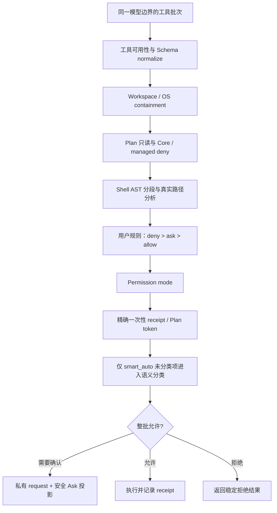

# Control、Plan 与权限架构

> 文档状态：Active 
> 面向读者：维护者、开发者 
> 最后核验：2026-07-22 
> 事实源：`packages/core/src/control/`、`packages/core/src/permissions/`、`packages/core/src/plans/`、`packages/core/src/environment/sandbox.ts`、slash command parser

Control 系统把“模型想做什么”和“Core 允许做什么”分开。界面、模型、Goal、Scheduler、Team 和 Hook 都不能自行扩大权限；最终决定由 Core 的 permission pipeline、pending interaction、workspace policy 和 mutation guard 共同完成。

## 三种执行权限与 Plan 状态

| 内部值            | Slash command | 语义                                                                                           |
| ----------------- | ------------- | ---------------------------------------------------------------------------------------------- |
| `ask_before_edit` | `/mode ask`   | 只读文件、搜索、列表和诊断直接执行；文件修改、Shell、外部写入、Team 与 Scheduler 变更需要确认  |
| `smart_auto`      | `/mode edits` | 自动执行工作区编辑、构建测试、安全复合命令和本地非破坏性 Git；发布、外部写入和高风险操作需确认 |
| `full_access`     | `/mode auto`  | 关闭普通权限审批；显式 deny、Plan 只读、schema、workspace、Goal 和 OS containment 仍然生效     |

Plan 仍以内部 `mode === plan` 表示只读运行状态，但不再作为第四种用户权限。`/mode ask|edits|auto|status` 只管理执行权限；`/plan` 默认开启 Plan，`/plan on|off|status` 保留完整控制语义。Composer 的 `/` 菜单、裸命令和显式命令都经过同一个 renderer 生命周期控制器，不把命令帮助文字插入输入框。

## 决策顺序

Control schema v2 只持久化以上三个内部值。加载 v1 时，`accept_edits` 原子迁移为 `smart_auto`，`auto` 原子迁移为 `full_access`，Plan 的 `previous_mode` 同步迁移。兼容命令和旧 API 参数仍接受旧值，但返回与后续持久化都使用 v2 值。

用户规则和确定性拒绝优先于模式。`full_access` 关闭的是 Permission Ask，不是 Core 安全边界；路径操作在执行前仍必须 canonicalize，并受 workspace allow / deny 规则限制。

普通澄清、Plan 审批和 Permission 审批是三类不同事实。`ask_user` 只解决目标、范围、产品取舍和验收歧义；删除、覆盖、推送、发布等行为是否需要授权只由 PermissionManager 判断。用户已经明确“全部删除”或给出精确路径后，模型直接调用工具，不得再次用普通文字要求安全确认。PlanDecision 也不因“删除/部署”等副作用词本身强制进入 Plan；只有架构、迁移、验收不清等真正改变实施方案的复杂度信号触发 Plan Guard。

多路径文件操作不能只画像第一个参数。`rename_file` 通过 Tool contract 同时暴露 source 与 destination；permission rule 的 `pathGlob` 对任一路径匹配即生效，敏感路径检测同样扫描完整集合。`delete_file` 与 `rename_file` 在 `ask_before_edit` 和 `smart_auto` 下固定产生高风险批准，`apply_patch` 在 `smart_auto` 中按普通精确文件编辑处理，但 `replace_all=true` 仍需批准。

`ask_before_edit` 对所有 Shell 命令统一要求确认，即使 Shell AST 能证明它只是只读诊断；免询问的只读能力仅限受 Core 类型约束的文件、搜索、列表和诊断工具。`smart_auto` 允许构建、测试、格式化、本地非破坏性 Git，以及逐段都能证明安全的 `&&` / `||` / 序列命令；例如 `grep && grep && wc && echo && tail` 不再产生权限询问。发布、部署、`git push`、权限提升、敏感数据、不确定副作用和不可逆删除仍需确认。

## Shell AST 与策略来源

`run_command` 先经过有界的 `emperor-shell-ast-v1` 分类器。它把引号拼接还原为 argv，识别 pipeline、`&&` / `||`、序列、后台、redirect/heredoc、命令或进程替换、参数/算术展开、subshell、brace group 和 control flow；嵌套命令替换中的命令也进入风险检查。解析失败、Unicode 隐蔽空白、控制字符、节点/深度/长度超限和无法证明的复杂结构一律不能晋升为只读。

只读不是单一首词白名单。Shell AST 会逐段检查命令、flags、重定向、环境变量、动态展开和路径；只有所有分段都通过确定性规则，复合命令才会自动执行。无法分类的 `smart_auto` 命令才进入独立 `permission_classifier` 模型路由；该调用禁用工具、temperature 为 0、输出最多 128 tokens、8 秒超时且不重试，只能返回 `allow` 或 `ask`。输入使用脱敏命令、AST 摘要、cwd/workspace、影响摘要和当前意图；超时、不可用、格式错误或低置信度统一回退 Ask，同一回合按脱敏指纹缓存。分类器永远不能覆盖确定性 deny。

每个 `PermissionDecision.explanation` 都包含所有规则候选的 action、source、trust、是否匹配与稳定 precedence，以及最终选中项。来源 trust 由加载层注入，不接受规则 JSON 自报。匹配候选按 `deny > ask > allow` 排序，同 action 再按 `system > managed > user > project > runtime > unknown`、specificity 和稳定输入顺序排序；低信任 allow 不能放宽高信任 ask/deny，Core 的 Plan、Auto 未证明只读、项目代码执行和高风险 shell 约束也不能被本地 allow 绕过。命令解释只保存结构、reason code、计数和 SHA-256 fingerprint，不保存 argv 或命令正文。

规则层先通过共享 `ConfigResolver` 归一化，再进入 Permission precedence。builtin/user/project/session/managed 的次序与输入数组无关；managed 规则最后进入约束面。标记为 untrusted 的 project layer 只能贡献 `ask` / `deny`，其中的 `allow` 在解析阶段就被拒绝，不会依靠后续碰巧出现的 deny 兜底。这个层只适配旧规则输入，不把规则搬到新文件，也不接受 manifest 或远程 campaign 自报 trust。

子代理 `AgentDefinition` 是 Permission 前的额外能力上限，不是新的 allow 来源。Extension source 的 trust 由 resolver loader 注入；session definition policy 只能求交集或选择更严格的 memory/sandbox/turn 上限。即使高优先级 manifest 声明某工具、网络或进程可用，Permission、workspace fence 或 OS containment 的 ask/deny/required 仍可继续收紧；manifest 和低层 session 数据不能覆盖这些 Core 约束。

分类器是可替换 capability，但调用边界必须使用 fail-closed wrapper。分类器抛异常或返回无效结果时，`run_command` 转为 Ask；新的 terminal/进程入口必须复用同一能力，而不是另写字符串 allowlist。

## 批量预检与精确一次性授权

Runner 对同一模型响应里的工具调用先做完整预检，再产生任何工具副作用：schema normalize、Ask/Plan Guard、`PreToolUse`、workspace containment 和 Permission 都先完成。任一调用参数错误、Hook deny 或确定性 deny 会阻止整批副作用并把可修复错误返回模型。最多合并 64 个操作。

同一批里需要审批的调用合并为一张 Permission 卡。批次指纹绑定 session、工具名、normalize 后参数、canonical workspace/cwd、解析后的目标路径，以及操作数量和重复次数；新增、删除、换序或修改任何操作都会得到不同指纹。批准不是工具级或目录级通行证。

权限请求私有记录保存在 `stateRoot/control/permission-requests.json`，使用原子替换与 `0600` 文件权限。记录包含完整 fingerprint、参数 hash、判权 trace/explanation、精确操作 multiset、30 分钟过期时间和 `waiting / approved / denied / consumed / cancelled` 状态；这些字段不进入 renderer、runtime event 或聊天历史。进程恢复时只保留仍有效且已绑定 interaction 的请求，过期、已消费、已取消和孤立请求被清理。

用户回答先持久化私有请求，再清除 pending interaction。恢复消息使用 `[CONTROL:PERMISSION_ANSWERED]` 和 request ID；Runner 只接受最新一条用户消息携带的该 ID，普通新用户消息不会继承旧授权。实际执行前原子消费精确 multiset；消费后崩溃采取 at-most-once / fail-closed，不自动重放破坏性操作。每次消费前仍重新检查 schema、明确 deny、Plan 和 containment，因此旧批准不能覆盖后来新增的规则。

启动恢复会按 interaction 声明的 `control_session_id` / `goal_session_id` 重建会话等待标记，不得把其他会话的问题挂到当前会话。owner session 已删除的 pending 会被取消；旧版本遗留的 `Ask Guard:` / `Permission Guard:` 问卷无法映射到当前权限语义，也会在 ControlManager 初始化时取消，避免其阻塞新的 Permission Ask。

`PermissionRequest` Hook 只能拒绝或转换参数。Hook 返回 `allow` 不能替用户批准 Core 的 Ask；参数转换后整批重新经过 schema、Guard、Hook 和 Permission。`PermissionDenied` 只用于观察最终拒绝，不能反向放宽。

## Permission 与 OS containment 是两份事实

Permission decision 只回答“Core 是否授权尝试这个 effect”，不等于操作系统已经把进程隔离。`run_command` 在获准后还要经过 `OsSandboxController`：macOS 使用系统 Seatbelt (`sandbox-exec`)，Linux 使用已通过 user-namespace probe 的 `bwrap`，Windows 当前明确报告 `windows-unsupported`。每次执行都产生独立 containment receipt，包含实际 backend、capability status、filesystem/network/process-tree 能力和 policy hash；receipt 不含 profile 原文、HOME 或完整 PATH。`OwnedProcessRunner` 在 spawn 前提交 receipt；提交失败时不启动进程，避免先产生副作用再丢失 containment 事实。

所有 `run_command` 都把 OS containment 设为 required。backend 缺失、probe 失败、平台不支持或 runner 返回 `unsandboxed` receipt 时，Core 在接受命令结果前 fail closed，并返回 containment 错误，不会把权限批准或“只读”分类伪装成 sandbox。当前 sandbox 只允许 workspace 和每次执行的私有临时目录写入，隐藏/拒绝 `stateRoot`，阻断 workspace 外读写、symlink/子进程逃逸和网络；读取系统运行库与受控 PATH root 只读放行。

Linux 的生产 backend 当前只有 bwrap：probe 不只检查文件存在，还实际启动最小 namespace。直接 Landlock 需要经过审核的 native helper，当前未随包提供，因此 capability matrix 把它视为“尚无实现”，不能用 kernel 版本推测 available。Windows 同理保留 Job Object + ACL 研究项，但在实现、攻击测试和 package receipt 完成前保持 unsupported。

### 用户直控 Terminal 不属于 Agent Permission

右侧项目工作台的 Terminal 是用户本人直接操作的系统 Shell，不是模型提出的 `run_command`，因此不进入 `ask_before_edit / smart_auto / full_access`、Permission Ask、Plan token、聊天历史或模型上下文。这个边界不能被复用于 Agent：模型、Hook、MCP、Scheduler、Team 和子代理都没有 Terminal write operation 的调用权，也不能把命令伪装成 renderer 输入。

Terminal 仍不是无边界 IPC。只有受信主窗口可调用固定 operation；Core 从 Build session 解析初始项目 cwd，校验 session/terminal owner、每会话最多 8 个终端并在关闭时清理。用户可以在 Shell 内自行 `cd` 到其他目录，这是明确的系统终端语义。相对地，Review 的 Git mutation 虽不生成聊天 Permission Ask，仍要求 trusted Renderer IPC、schema、session/project 归属、expected revision 和对应二次确认；discard 还必须先生成 FileCheckpoint。这些用户点击入口不能被 Agent 工具调用或普通网页调用。

## Ask 生命周期

Ask 是持久的用户交互，不是普通 assistant 文本：

1. Core 先创建私有 PermissionRequest，再创建仅含安全 operation 摘要的 pending interaction。
2. Runner 暂停当前 turn；renderer 保留时间线中的静态 Ask 历史卡，并在底部用活动 Ask 面板替代 Composer。
3. 用户决定由 CoreApi 提交，Core 验证 interaction、稳定 option ID 与 session 的归属。
4. 一次性允许只对对应请求生效；拒绝不会被 Goal continuation 或后台任务跳过。
5. 重启后 pending interaction 仍按 Store 状态恢复。

权限 Ask 的稳定 option ID 为 `allow_once`、`deny` 和 `allow_and_full_access`；中文标签只负责展示。可见卡片按顺序列出脱敏后的工具名、风险、短原因和命令/文件摘要；完整 fingerprint、规则、trace、explanation 与参数只留在私有 PermissionRequestStore/Diagnostics。历史上以 `Permission Guard` 或 `Ask Guard` 开头的 context 会被兼容净化，不再把原始 JSON 渲染到聊天。`ask_user` 是模型向用户补充信息的普通产品交互，不受 `full_access` 禁止；它不能代替权限授权。

## Plan 生命周期

进入 Plan 时，Core 把当前执行权限保存在 `previous_mode`，并立即用一个新的 DRAFT 原子替换同一 session/scope 中尚未终结的当前 Plan。被替换 Plan 的 permission token 与既有后台/Goal PlanStep 调度 Task 会撤销；普通前台 Plan 不自动创建 Task。旧版本遗留的 `plan:<stepId>` Todo 镜像在会话绑定时一次性清理，旧 Plan 记录只保留审计用途，后续取消新 Plan 也不会恢复旧 Plan。Plan 阶段允许只读探索、`ask_user` 和 `propose_plan`，不允许项目写入或 `update_todos`；用户仍可调用 `control.setPermissionMode` 修改 `previous_mode`，而不退出 Plan。批准方案或执行 `/plan off` 后，Core 使用最新保存的权限继续。

Renderer 还维护一个会话级 Goal capture 投影，表示“已经选择 Goal，正在等待 Outcome”。它不是 Core control mode，也不是持久 Goal。裸 `/goal` 和 Composer 菜单共用这个投影；下一条纯文字才会调用 `goals.start`。会话切换、应用重启或用户关闭标识都会清除该投影。Goal 创建失败时投影回到待输入状态，避免把失败当成已启动。

### Composer 顶层生命周期互斥

Renderer 将 active Goal、Goal capture 和独立 Plan 投影为单一 `goal | plan | null` 状态。判定时 Goal 优先：只要 Goal 或 capture 存在，即使 Core 因 Goal 内部规划而处于 `mode === plan`，Composer 也只显示 Goal。

生命周期控制器串行处理所有切换：

- Plan → Goal：先恢复 `previous_mode`，成功后才能进入 capture 或创建 Goal。
- Goal capture → Plan：先清除 capture，再开启 Plan；Composer 草稿不属于 capture，因此不会被清空。
- `paused` / `awaiting_user` Goal → Plan：以 `user_switch_to_plan` 原因永久取消 Goal，再开启独立 Plan。
- `contract` / `planning` / `executing` / `verifying` Goal → Plan：拒绝切换。
- 普通 Agent turn、Goal 启动或另一次生命周期转换进行中：拒绝新的切换。

Goal 取消成功但 Plan 开启失败属于不可回滚的部分成功：旧 Goal 保持终态，renderer 报告明确错误。Goal 通过其他路径进入终态时，renderer 会恢复残留的 `previous_mode`；由 Goal → Plan 切换产生的终态带去重标记，避免终态监听器误关刚开启的独立 Plan。

Plan 保存步骤、依赖和验证要求。只有成功的 `propose_plan` 能把 DRAFT 提交为 waiting 审批；普通 assistant 最终文本不会创建 PlanCard。模型未提交工具时 Runner 只纠正一次，再次失败返回 `plan_generation_failed`。对同一草稿提出修改意见时复用 Plan ID、递增审批代次并覆盖正文；未知、重复、过期或代次不匹配的决定均 fail closed。

Plan 批准后的步骤以 `implementing / verifying / repairing / waiting_user / completed / cancelled` 阶段执行。模型必须用 `complete_plan_step` 提交实现声明；required verification 通过或被用户明确豁免后才能完成步骤。人工验证、验证工具不可用或连续相同验证失败会进入 `waiting_user`，Core 停止继续修改项目并生成签名决策卡。卡片动作绑定 session、Plan、Step、`approval_generation`、验证项和 interaction，不能由中文“取消/跳过/强制完成”等普通文本触发。人工通过记录 `user_manual_verification` 证据；豁免把指定 requirement 标为 `skipped` 并保存用户批准 receipt；取消会撤销 Plan permission token、取消非终态 Task并清理旧版本 Todo 镜像，但不会回滚已经写入的文件，也不会删除独立 WorkItem。

非平凡 Plan 的 `verification_reviewer` 结果也由 Core 结算，而不是由模型转述：Runner 只采信当前 session、当前 Plan generation 下由 Core 实际执行的 reviewer 工具结果，解析其终态 `verdict` 与 command evidence，并幂等写入 `independent_verification` receipt。同一工具结果不会重复入账，同一模型批次只允许一个 reviewer。PASS 且命令证据完整后，Final Reply Gate 只允许一次无工具最终交付；`ask_user` 不能再用于“是否满意/是否结束”等交付确认，也不能改变 Plan 终态。FAIL 才回到修复和重新验证；证据缺失不能伪造 PASS。

Plan 执行结算使用 `stateRoot/control/plan-execution-settlements.json` 的 prepared/applied 私有事务记录。Plan、Step、验证证据、可选的后台/Goal 调度 Task、pending interaction、checkpoint、变更快照和唯一 runtime 里程碑按幂等顺序收敛；独立 WorkItem 不参与 Plan 终态裁决。进程中断后 prepared 记录会重放，Plan metadata 中的 settlement receipt 防止重复应用。普通 Ask 被关闭时只暂停当前 Plan；若存在既有后台 Task 则同步为 pending，普通前台 Plan不会为此合成 Task，也不让 sidebar 保留假 running。

Plan permission token 只授权与已批准方案匹配的执行，不覆盖高风险限制、workspace policy 或新的 Ask。方案被修改、替换或失效后，旧 token 不能继续使用。PlanStep 是前台计划事实；Task 只用于 Goal、子代理、Team、后台进程、Scheduler 或具有 owner/dependency/lease 的跨回合调度，普通 PlanStep 不自动创建 Task。`update_todos` 只维护至少三个独立工作单元或用户明确要求的 WorkItem；三者不再逐项镜像。任何带 `plan_id`、`plan_step_id`、`approval_generation` 或 `plan:<stepId>` 的新 Todo 更新都会在副作用前拒绝或按旧镜像丢弃，不能推进 Plan。实现声明与步骤要求的验证证据同时满足后，权威 PlanStep 才能完成并激活下一步。

进展看门狗触发暂停时，Plan/Step 保持 `executing/active`，`execution_pause` 持久化剩余动作与迭代事实；仅既有后台/Goal 调度 Task 转为 `pending`，普通前台 Plan 不创建 Task。独立 WorkItem 保持自身状态，明确继续后才恢复 Plan 执行。

Renderer 中 PlanCard 是静态提案历史卡，不承载活动审批控件或执行进度。`plan_draft_delta` 形成的 provisional 卡只显示“生成中”；Core 提交正式 `plan_draft` 并建立 waiting interaction 后，底部才用 Plan 决策面板替代 Composer。批准、步骤开始/完成/失败、验证开始/通过/失败及计划终态都按 runtime event 顺序投影为卡片下方的 `plan_activity` 时间线节点；thought、文本与 ToolGroup 继续插在这些里程碑之间。Ask/Plan 回答、批准、评论或取消后恢复原 Composer，renderer 通过 `v-show` 保留草稿、附件和能力引用，并恢复输入焦点。

Plan 可以独立用于一次任务，也可被 Goal 绑定。绑定到 Goal 的 Plan 是内部阶段，不构成第二个 Composer 顶层模式。Goal 中 Plan 完成只表示步骤执行完毕；Goal 还要通过 Acceptance Criteria、Evidence 和 Completion Gate。

## 领域 mutation guard

CoreApi 对 Scheduler、Team、Goal、Hooks 和其他领域 mutation 使用统一 guard。存在 pending Ask / Plan，或者当前权限不允许时，后台入口也必须暂停或拒绝。Renderer 不能通过调用另一条 operation 绕开正在等待的交互。

具体边界：

- Goal 不提高权限，恢复 Goal 也不会自动批准旧请求。
- Scheduler 到时触发的 turn 与普通 turn 使用同一套权限约束。
- Team / subagent 输出是输入或证据候选，不是授权决定。
- Hook 可以观察和提出动作，不能直接写入 Goal 终态。
- `hooks.testRun` 即使已有显式执行确认，也必须在解析或启动 handler 前通过 Plan/pending mutation guard。
- Todo、Plan 卡片和普通 assistant 最终回复都没有领域终态写权限。

## 修改时必须同步

- 权限模式：slash parser、command palette、Core 类型、持久化与用户文档。
- 新工具风险：tool metadata、permission pipeline、只读判定、测试。
- Plan 语义：Plan Store、token 验证、renderer interaction 与 Goal bridge。
- 新领域 mutation：CoreApi guard、pending interaction 行为、重启恢复与诊断。

用户操作说明见[Plan 与 Goal](../user/plan-goal.md)，执行链路见[Agent runtime](agent-runtime.md)。
