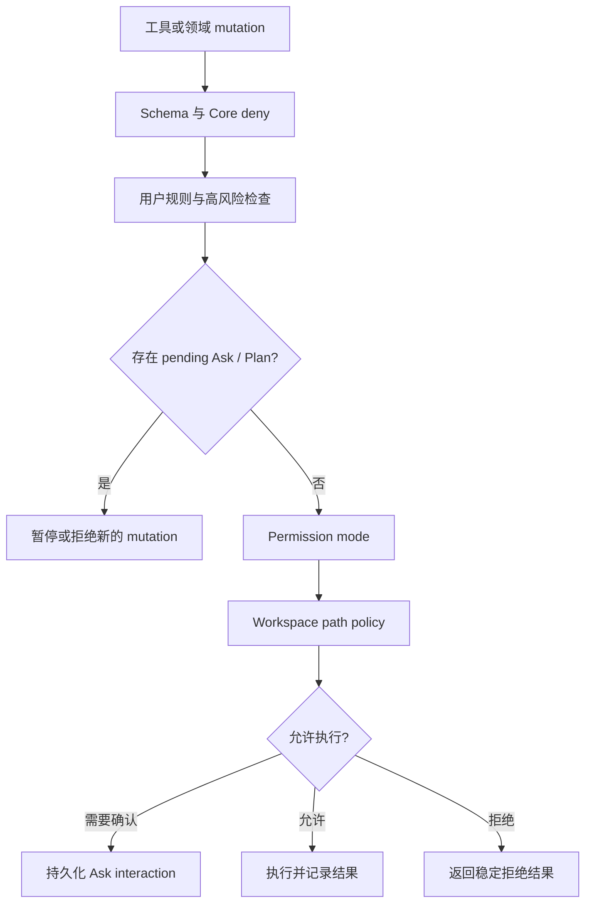

# Control、Plan 与权限架构

> 文档状态：Active 
> 面向读者：维护者、开发者 
> 最后核验：2026-07-18 
> 事实源：`packages/core/src/control/`、`packages/core/src/permissions/`、`packages/core/src/plans/`、slash command parser

Control 系统把“模型想做什么”和“Core 允许做什么”分开。界面、模型、Goal、Scheduler、Team 和 Hook 都不能自行扩大权限；最终决定由 Core 的 permission pipeline、pending interaction、workspace policy 和 mutation guard 共同完成。

## 三种执行权限与 Plan 状态

| 内部值            | Slash command | 语义                                                                               |
| ----------------- | ------------- | ---------------------------------------------------------------------------------- |
| `ask_before_edit` | `/mode ask`   | 低风险读取、普通文件写入和只读诊断命令可直接执行；敏感路径、批量替换和代码执行询问 |
| `accept_edits`    | `/mode edits` | 普通文件编辑可直接执行；shell、高风险和非文件 mutation 仍按规则询问                |
| `auto`            | `/mode auto`  | 在既有安全策略内尽量继续；不能证明为只读的 shell 命令仍需批准                      |

Plan 仍以内部 `mode === plan` 表示只读运行状态，但不再作为第四种用户权限。`/mode ask|edits|auto|status` 只管理执行权限；`/plan` 默认开启 Plan，`/plan on|off|status` 保留完整控制语义。Composer 的 `/` 菜单、裸命令和显式命令都经过同一个 renderer 生命周期控制器，不把命令帮助文字插入输入框。

## 决策顺序

用户规则和确定性高风险限制优先于模式。`auto` 不是关闭安全检查，`accept_edits` 也不是 shell 的通行证。路径操作在执行前必须 canonicalize，并受 workspace allow / deny 规则限制。

默认免审命令只包含经正向证明为只读的诊断入口。`pytest`、`python -m pytest`、`npm test`、`npm run ...` 等会加载项目控制的代码，必须创建高风险权限 Ask；命令名、测试框架或日常使用频率不能替代这个边界。显式用户规则和精确 Plan permission token 仍可按既有顺序受控授权。

## Ask 生命周期

Ask 是持久的用户交互，不是普通 assistant 文本：

1. Core 创建带 operation、风险和上下文的 pending interaction。
2. Runner 暂停当前 turn；renderer 展示允许的选择。
3. 用户决定由 CoreApi 提交，Core 验证 interaction 与 session 的归属。
4. 一次性允许只对对应请求生效；拒绝不会被 Goal continuation 或后台任务跳过。
5. 重启后 pending interaction 仍按 Store 状态恢复。

`ask_user` 是模型向用户补充信息的交互入口；权限 Ask 则由 Core 决策产生。两者都必须通过正式 interaction 解决，不能从普通回复推断“用户已经同意”。

## Plan 生命周期

进入 Plan 时，Core 把当前执行权限保存在 `previous_mode`。Plan 阶段允许只读探索、`ask_user` 和 `propose_plan`；用户仍可调用 `control.setPermissionMode` 修改 `previous_mode`，而不退出 Plan。批准方案或执行 `/plan off` 后，Core 使用最新保存的权限继续。

Renderer 还维护一个会话级 Goal capture 投影，表示“已经选择 Goal，正在等待 Outcome”。它不是 Core control mode，也不是持久 Goal。裸 `/goal` 和 Composer 菜单共用这个投影；下一条纯文字才会调用 `goals.start`。会话切换、应用重启或用户关闭标识都会清除该投影。Goal 创建失败时投影回到待输入状态，避免把失败当成已启动。

### Composer 顶层生命周期互斥

Renderer 将 active Goal、Goal capture 和独立 Plan 投影为单一 `goal | plan | null` 状态。判定时 Goal 优先：只要 Goal 或 capture 存在，即使 Core 因 Goal 内部规划而处于 `mode === plan`，Composer 也只显示 Goal。

生命周期控制器串行处理所有切换：

- Plan → Goal：先恢复 `previous_mode`，成功后才能进入 capture 或创建 Goal。
- Goal capture → Plan：先清除 capture，再开启 Plan；Composer 草稿不属于 capture，因此不会被清空。
- `paused` / `awaiting_user` Goal → Plan：以 `user_switch_to_plan` 原因永久取消 Goal，再开启独立 Plan。
- `contract` / `planning` / `executing` / `verifying` Goal → Plan：拒绝切换。
- 普通 Agent turn、Goal 启动或另一次生命周期转换进行中：拒绝新的切换。

Goal 取消成功但 Plan 开启失败属于不可回滚的部分成功：旧 Goal 保持终态，renderer 报告明确错误。Goal 通过其他路径进入终态时，renderer 会恢复残留的 `previous_mode`；由 Goal → Plan 切换产生的终态带去重标记，避免终态监听器误关刚开启的独立 Plan。

Plan 保存步骤、依赖和验证要求。Plan permission token 只授权与已批准方案匹配的执行，不覆盖高风险限制、workspace policy 或新的 Ask。方案被修改、替换或失效后，旧 token 不能继续使用。

Plan 可以独立用于一次任务，也可被 Goal 绑定。绑定到 Goal 的 Plan 是内部阶段，不构成第二个 Composer 顶层模式。Goal 中 Plan 完成只表示步骤执行完毕；Goal 还要通过 Acceptance Criteria、Evidence 和 Completion Gate。

## 领域 mutation guard

CoreApi 对 Scheduler、Team、Goal、Hooks 和其他领域 mutation 使用统一 guard。存在 pending Ask / Plan，或者当前权限不允许时，后台入口也必须暂停或拒绝。Renderer 不能通过调用另一条 operation 绕开正在等待的交互。

具体边界：

- Goal 不提高权限，恢复 Goal 也不会自动批准旧请求。
- Scheduler 到时触发的 turn 与普通 turn 使用同一套权限约束。
- Team / subagent 输出是输入或证据候选，不是授权决定。
- Hook 可以观察和提出动作，不能直接写入 Goal 终态。
- `hooks.testRun` 即使已有显式执行确认，也必须在解析或启动 handler 前通过 Plan/pending mutation guard。
- Todo、Plan 卡片和普通 assistant 最终回复都没有领域终态写权限。

## 修改时必须同步

- 权限模式：slash parser、command palette、Core 类型、持久化与用户文档。
- 新工具风险：tool metadata、permission pipeline、只读判定、测试。
- Plan 语义：Plan Store、token 验证、renderer interaction 与 Goal bridge。
- 新领域 mutation：CoreApi guard、pending interaction 行为、重启恢复与诊断。

用户操作说明见[Plan 与 Goal](../user/plan-goal.md)，执行链路见[Agent runtime](agent-runtime.md)。
