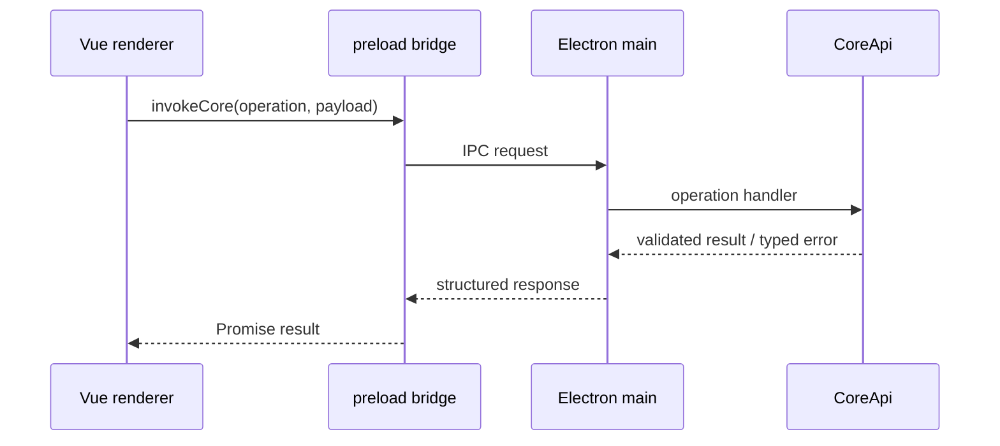

# IPC 与 Runtime Events

> 文档状态：Active 
> 面向读者：桌面端与 Core 开发者 
> 最后核验：2026-07-19 
> 事实源：`desktop/src/main/core-host.ts`、`desktop/src/preload/`、`packages/core/src/runtime/events.ts`、`packages/core/src/runtime/envelope.ts`、`packages/core/src/runtime/store.ts`、`desktop/src/renderer/src/runtime/`

Electron renderer 不直接导入 Core，也不访问本地 Store。同步请求通过 preload 的 Core IPC contract，异步过程通过 runtime events。两条链路共同构成桌面主路径。

主 BrowserWindow 显式固定 `sandbox: true`、`contextIsolation: true`、`nodeIntegration: false`。Sandboxed preload 必须输出为单文件 `index.cjs`，运行时只允许 `require('electron')`；build 和 after-pack 会同时拒绝 ESM、Node builtin、超尺寸或缺失 `emperor` bridge 的产物。Preload 只把 operation key 映射进固定 `emperor:core:` namespace；main 只为 Core registry 中的真实 key 注册 handler，所以未知 key 没有执行面，畸形 key 也不能逃出 namespace。

## 请求链路

operation 是显式 allowlist。Renderer 传入的数据必须在 Core 边界重新校验；renderer 已校验、TypeScript 类型或隐藏按钮都不是安全边界。

所有 operation 在参数解析和领域调用前先经过 `LifecycleSupervisor.assertReady()`。required service 尚未全部 ready、启动已失败或 Core 正在关闭时，IPC 返回 `{ ok: false, error: { code: "core_unavailable", action: "retry" } }`，领域方法没有被调用。Electron main 只有在 `CoreApi.create()` 和后续初始化都成功后才把 host 视为 ready。

## Runtime event 链路

模型增量、工具调用、Ask / Plan、Scheduler、Goal 和其他过程状态由 Core 产生 runtime event：

1. Core 生成白名单化事件并写入 owner session 的 runtime store。
2. Main 的 event bridge 把 live event 推给 renderer。
3. Renderer 的 domain reducer 将事件纯投影成卡片、消息和状态；live-only 行为由 effect executor 执行。
4. 刷新或重启时，bootstrap 返回历史与可 replay 的事件；live 与 replay 复用同一 projection reducer，但 replay 不执行 timer、IPC refresh、toast callback 等副作用。

事件必须带 session 归属和可用于去重的顺序信息。后台任务的事件写入任务所属 session，不能因为用户切换了当前页面而写入前台 session。Bootstrap 的 `runtime.busy` 只表示当前 session 是否有 active task；`active_tasks` 和 Diagnostics 仍可列出其他 session 的并行工作。

## EventEnvelope V2 兼容边界

Runtime store 的 reader 同时接受历史平面事件 V1 和 `EventEnvelopeV2`。V2 提供稳定 `eventId`、可选 `idempotencyKey`，以及 session、turn、request、attempt、task、parent task、tool call、owner 和 sequence 的统一关联字段。历史 V1 文件不会被原地改写；reader 为 V1 生成可重复的 legacy event ID，并可投影为 V2 读取结果。

V2 writer 当前受 `EMPEROR_EVENT_ENVELOPE_V2=1` 控制，默认仍写 V1。显式 append 选项可在测试或受控迁移中覆盖该开关；SamplingCoordinator 的 `model_attempt_*`、TaskRuntime 的 `task_*`、工具调度器的 `tool_*`、命令 containment 的 `process_containment` 与 MCP 的 `mcp_connection_state` 是当前生产强制 V2 writer，分别保证 request/attempt、task terminal、tool call terminal、实际 sandbox backend 与 MCP generation 对账不被旧投影丢失。Task 事件携带 task ID、revision 组成的幂等键；工具和 containment 事件携带 `toolCallId`；MCP 状态以 server/client generation/state/活动数构造幂等键。它们只包含有界 record、状态、错误摘要或不含路径的 receipt，完整 output 留在受管 artifact。无论磁盘写入格式为何，live bridge 和默认 `runtime.replay` 都返回兼容的平面 projection；维护工具可调用 `runtime.replay({ format: 'envelope_v2' })` 读取统一 envelope。压缩和归档保持磁盘原格式，不能把 V2 降级成 V1。

同一 session 的 sequence 保持单调；相同 `idempotencyKey` 在热日志、归档和进程重启后都只对应第一次提交的事件。Renderer 对默认 projection 继续按 session + sequence 去重，所以重复消费同一 replay batch 不改变投影状态。

## Renderer Action / Effect 边界

Renderer 的 session、task 和 runtime replay 已使用小型 domain action reducer。`sessionProjection.ts` 独立维护 active cursor、各 session cursor、running/attention 和 transport projection；乱序或重复的低 sequence 事件在改变 spinner 前即被拒绝。`taskProjection.ts` 按 task ID/sequence 归约，terminal task 不会被迟到的 running/progress 事件改回非终态。`rendererProjection.ts` 先稳定排序再完成纯 replay，并明确返回空 effect 列表。

异步或定时行为使用 `ActionEffectStore`：reducer 只返回 domain-local effect descriptor；executor 接收 `AbortSignal` 和 deadline；成功、错误、取消或超时都转成 `TaskResult` action，再次经过同一 reducer。当前 Core event subscription 属于 session effect，pending 自动清除属于 pending effect，assistant 完成后的 memory refresh 属于 runtime effect。相同 effect key 会取消旧任务并隔离迟到结果；effect error 只保留有界 name/message，不把 `Error`、DOM handle 或 unsubscribe function 放进 projection state。

这不是第二套业务状态机。Core Store / ledger 仍是权威事实，renderer action state 只是可重建投影；Vue composable 继续提供原 public API，并把 domain state 桥接到响应式 refs。后续领域应新增自己的 reducer/effect 文件，不把所有行为汇总成一个巨型 root enum 或 effect switch。

`visibility` 的值为 `model`、`user`、`diagnostic` 或 `internal`。模型上下文只能通过显式的 model-visible projection 读取 `model` 事件，`diagnostic` 永不混入模型消息。Envelope 不扩大 payload 权限：producer 仍须执行字段白名单和脱敏，不能默认写入原始 prompt、secret 或未筛选的工具输入/输出。诊断事件只存本机 runtime store；这条链路不发送云 telemetry。

模型 attempt 事件只记录模型/provider 元数据、错误分类、退避时长和 correlation ID，不记录 prompt、API key 或原始 provider response。一次 attempt 必须恰有 started 和一个 terminal；`model_provider_retry` 保留为兼容投影，真实预算与时间线以 `model_attempt_*` 为准。

`context_projection` 的 report 额外记录 prompt stable/dynamic hash、canonical/projected history hash、cache-break classification/reason/首个变化位置和并发 prefetch 状态；`context_usage` 记录 provider 报告的 cache read/create token、是否命中、同一 stable-prefix hash 与 cache-break 原因。显式模型策略还会附加 fallback identity/reason、known nano-USD subtotal、cap 和 `cost_complete`；缺失/失败 usage 不能序列化为零成本。`model_route_fallback` 是用户可见的一次 transition 投影，包含 from/to model 与 entry ID，但不包含 prompt、API key、价格表或 provider 原始错误。这些字段都是 metadata，禁止携带 section 正文、消息内容、附件字节或工具输出。Diagnostics 的 Prompt Cache Break 行来自最近的脱敏 prompt snapshot，不从模型回复推断。

工具调度事件遵守相同的终态不变量：每个 `tool_run_queued` 必须恰有一个 completed / failed / cancelled 终态。流式响应删除调用、父 turn 取消或执行 Promise 忽略 abort 时，Core 仍先写 cancelled tombstone；迟到结果被隔离，不得制造第二终态。

忙碌 prompt 使用 `prompt_queued`、`prompt_dequeued`、`prompt_interjected`、`prompt_cancelled` 投影 durable queue 状态；correlation 使用 `prompt_id`、`client_message_id`、prompt `turn_id` 和可选 owner `target_turn_id`。`prompt_queued` 可以带用户已提交的有界显示文本，以便 live event 丢失后从 replay 重建占位消息。旧 assistant partial 由 `message_tombstoned` 结束，renderer 必须关闭其 streaming/tool 状态并为同一 owner turn 创建新的 assistant 投影，不能把替代回答合并进旧 partial。重复 replay 仍按 sequence 幂等。

## 三类数据不要混淆

| 数据                  | 用途                                          | 是否权威                  |
| --------------------- | --------------------------------------------- | ------------------------- |
| Session history       | 模型可见的对话与工具消息                      | 对会话内容权威            |
| Message graph sidecar | 分支、leaf、partial tombstone 与 prompt queue | 对 V2 链和 queue 状态权威 |
| Domain store / ledger | Goal、Plan、Scheduler 等业务状态              | 对对应领域权威            |
| Runtime events        | renderer 的过程投影与恢复                     | 不是领域终态的替代品      |

例如 `goal_completed` runtime event 只能在 Completion Gate 已提交终态后发出。即使投影事件暂时失败，Goal ledger 仍是事实源；Core 可在 bootstrap 时重建摘要。

## 本地资源协议

附件与 media 通过受限的 `app://` URL 读取。Main 根据受管 ID 解析 `stateRoot` 中的文件，校验目录和类型，不接受 renderer 提供任意绝对路径。`bundle`、`attachments`、`media`、`pet` 与 `pet-assets` 按 host 分流；静态资源 resolver 拒绝 traversal、畸形编码和 extensionless fallback。Electron 42 对跨 host fetch 要求 scheme 显式启用 CORS，因此 `app` scheme 开启 `corsEnabled`，同时 main 只允许 `app://bundle` 读取 attachment/media、`app://pet` 读取 pet-assets，其他显式 Origin 返回 403。Attachment/media host 永不成为可信 IPC origin。

Packaged smoke receipt schema 2 会真实创建隐藏的生产 BrowserWindow、加载 ASAR 内的 `app://bundle/index.html`，再从 renderer main world 证明 Node globals 不存在、preload 报告 sandboxed、Core bootstrap 可调用、临时 attachment 字节可精确读取。Receipt 还固定 context isolation on、Node integration off，且不包含临时路径或 attachment ID。Linux 容器若使用仅限测试的 `--no-sandbox`，receipt 必须写 `disabled-for-linux-test`，不能把 renderer Node 隔离误报成 Chromium OS sandbox；macOS/Windows 正常 smoke 必须写 `enabled`。

桌宠窗口使用相同的显式 sandbox 不变量，但不复用主 Core bridge。其 preload 只从受 pet webContents、top frame 和 `app://pet` host 约束的专用 IPC 取得最近 runtime/control 投影，live event 仍由固定 event channel 推送；它不使用 `fs/path`，也不轮询 `stateRoot`。普通浏览器运行模式不属于当前产品支持边界。

## 新增 operation

新增 CoreApi operation 时至少同步：

1. CoreApi operation 类型、schema 和 handler。
2. Electron main 的 operation allowlist / contract。
3. Preload bridge 的输入输出类型。
4. Renderer API 映射和调用方。
5. IPC contract、错误与权限测试。

operation 若会修改状态，还必须接入对应 permission / mutation guard，而不是只在 renderer 禁用按钮。

后台子代理控制是一组 owner-fenced operation：`tasks.wait` 和 `tasks.readOutput` 是只读观察，`tasks.cancel` 和 `tasks.resume` 先经过 mutation guard；四者都要求 Task 属于当前 active session。输出按 cursor 返回且不暴露本地绝对路径。应用重启后，旧 Task 可以读取和确认 `interrupted`，但 `resume` 会因进程内 launch descriptor 已消失而安全拒绝。

owned process 控制使用 `processes.list`、`processes.cancel` 和 `processes.reparent`。List 只投影当前 active session 的脱敏 receipt；cancel/reparent 还要通过 mutation guard、owner session 和 lease fence。Reparent 只接受 `session` / `task` / `terminal` owner，不能跨 session，并会签发新 lease 使旧请求失效。IPC 不暴露 spawn、stdin/stdout handle、原始 command/argv/env/output 或按 PID 操作的入口；PID 不是授权身份。

文件检查点使用 `fileCheckpoints.list`、`fileCheckpoints.preview`、`fileCheckpoints.rewind` 和 `fileCheckpoints.rewindGit`。输入只接受 session/checkpoint ID；workspace 由 Core 从受信 SessionEntry 推导。纯文件 `rewind` 的 schema 必须包含字面量 `confirmed: true`；Git 路径还必须包含 `confirmedGitRisk: true`、前一次预览的 SHA-256 revision，以及 `abort|stash` dirty strategy。输出仅含 ID、工具/turn 元数据、相对路径、change kind、大小、状态与哈希；Git capture 只投影 OID、branch、计数和 identity digest，不返回快照正文、artifact/private store、`.git` 或 workspace 绝对路径。两条回退都经过 mutation guard 和领域冲突检查；renderer 隐藏按钮不构成授权。

MCP 使用 `mcp.getConfig` / `mcp.saveConfig` 管理配置。Get 保留 `${ENV_NAME}`，但将 args、env、headers、URL 中其余字面字符串逐叶投影为 `[REDACTED]`；Save 仅从同一路径的磁盘旧值回填掩码，孤立掩码 fail closed，避免 renderer 读取密钥或用掩码覆盖密钥。`mcp.status` 只读返回每 server 的 generation、client ID、state、auth/health、工具名快照、退避和活动 request 计数。它不返回 header/env 值、原始 transport 错误或工具结果。Bootstrap 与 Diagnostics 返回同一状态结构，插件页不通过“工具数组是否为空”猜测连接健康。

`config.effective` 是只读解释面，不是新的写入入口。它返回按 key 排序的可复现 snapshot、revision、effective value、最终 source/trust、逐层 applied/rejected trace 与 secret source。MCP 的 args/env/headers/url 在这个 payload 中整段显示为 `[REDACTED]`，trace fingerprint 也基于脱敏值；密钥不会写入 runtime event。MCP 原文件 schema 保持不变；`mcp.getConfig/saveConfig` 的 IPC 形状也保持不变，但 secret leaf 使用上述掩码往返协议。

## 新增 runtime event

新增事件时至少同步：

1. Core event union、构造点和持久化策略。
2. Main bridge 的转发与字段过滤。
3. Renderer `types.ts`。
4. 纯 reducer、domain effect / `TaskResult`、专用 handler 和 `useRuntime` bridge。
5. Live、replay、bootstrap、重复与跨 session 测试。

Payload 应保持有界，不包含密钥、任意绝对路径或未经筛选的工具原始输出。大对象保存在受管 Store，只在事件里传 ID 和摘要。

## 失败与恢复

- IPC 输入无效：Core 返回结构化错误，不执行部分 mutation。
- Renderer 关闭：领域执行与持久化不应依赖 DOM 生命周期。
- Live event 丢失：重连后由 bootstrap / replay 恢复。
- 重复/乱序 event：renderer 先按 owner session 的 seq 幂等处理，终态不会被较旧事件复活。
- 并行 session：每个 actor 写自己的 runtime store；取消或重放 A 不推进 B 的 cursor。
- Task 取消：先提交 durable terminal，再 abort runtime handle；晚到结果因 Task revision/CAS 失败而丢弃。
- 进程重启：内存 handle 不伪装成可恢复 Promise；runtime-managed `running` task reconcile 为 `interrupted`。ProcessRuntime 只按 boot marker + stable start identity 回收可证明的孤儿，绝不按裸 PID 重新 attach 或盲杀。
- Domain 已提交但投影失败：保留领域真相，记录诊断并重建投影。

完整 turn 顺序见[Agent runtime](agent-runtime.md)，数据位置见[全局私有存储根](global-state-store.md)。
