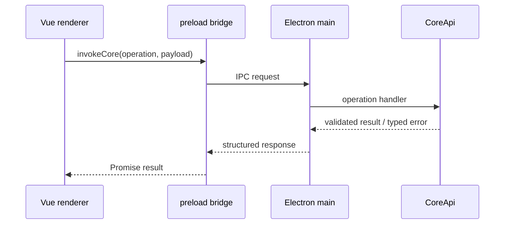

# IPC 与 Runtime Events

> 文档状态：Active 
> 面向读者：桌面端与 Core 开发者 
> 最后核验：2026-09-24 
> 事实源：`packages/core/src/api/operations.ts`、`desktop/src/main/core-host.ts`、`desktop/src/main/ipc.ts`、`desktop/src/preload/`、`packages/core/src/harness/projection/`、`packages/core/src/session-log/history.ts`、`packages/core/src/harness/host/session-views.ts`、`packages/core/src/public/runtime-contract.ts`、`desktop/src/shared/ipc-contract.ts`、`desktop/src/main/desktop-capability-ipc.ts`、`desktop/src/main/browser-view.ts`、`desktop/src/main/browser-view-policy.ts`、`desktop/src/preload/desktop-capabilities.ts`、`desktop/src/main/event-bridge.ts`、`packages/core/src/workspace/pull-request-browser.ts`、`desktop/src/renderer/src/conversation/`、`desktop/src/renderer/src/runtime/`

Electron renderer 不直接导入 Core，也不访问本地文件。同步请求走 preload 的 Core IPC contract；异步过程分两条管线：Chat 与 Trajectory 渲染所需的原始 session 事件走独立的 session event 通道，其余状态走 runtime events（UiEvent）。

主 BrowserWindow 固定 `sandbox: true`、`contextIsolation: true`、`nodeIntegration: false`。Sandboxed preload 输出为单文件 `index.cjs`，运行时只允许 `require('electron')`；build 和 after-pack 会拒绝 ESM、Node builtin、超尺寸或缺失 `emperor` bridge 的产物。Preload 只把 operation key 映射进固定的 `emperor:core:` namespace；main 只为 Core registry 中的真实 key 注册 handler。

## 请求链路

```mermaid
sequenceDiagram
  participant UI as Vue renderer
  participant Preload as preload bridge
  participant Main as Electron main
  participant Core as CoreApi
  UI->>Preload: invokeCore(operation, payload)
  Preload->>Main: IPC request
  Main->>Core: operation handler
  Core-->>Main: validated result / typed error
  Main-->>Preload: structured response
  Preload-->>UI: Promise result
```

Operation 的名称与参数 schema 定义在 `packages/core/src/api/operations.ts`，是显式 allowlist。Renderer 传入的数据在 Core 边界用 zod 重新校验；TypeScript 类型或隐藏按钮都不是安全边界。`createCoreHost()` 在 `CoreApi.create()`（含内核启动、MCP 初始化和 Scheduler 启动）完成后才注册 IPC handler。

已退役的 operation 仍保留名称以便旧调用得到明确错误：`environment.createInstallPlan`、`environment.install` 和 `tasks.resume` 会返回 `OperationRetiredError`，附带建议的替代动作。旧的 `skills.previewInstall`、`skills.confirmInstall` 与 `skills.package` 已从注册表移除，Skill 安装改用 `skills.import`。

## 主要 operation 分组

| 分组                                                                                                           | 用途                                                                                            |
| -------------------------------------------------------------------------------------------------------------- | ----------------------------------------------------------------------------------------------- |
| `chat.*`                                                                                                       | 提交消息、列出和管理排队消息、停止运行                                                          |
| `sessions.*`、`sidebar.*`                                                                                      | 会话列表、创建、重命名/归档、删除、激活；原始历史分页、祖先链、子代理列表、watch 集合；侧栏布局 |
| `control.*`                                                                                                    | 读取控制状态、切换权限预设与 Plan 模式、回答交互                                                |
| `commands.*`                                                                                                   | Slash command 列表、补全、调用                                                                  |
| `goals.*`                                                                                                      | 当前 session 的 Goal                                                                            |
| `tasks.*`                                                                                                      | 后台 job 与子代理会话（列表、详情、transcript、等待、读取输出、取消）                           |
| `tools.readResult`                                                                                             | 读取落盘到 `stateRoot/spill/` 的完整工具结果                                                    |
| `runtime.replay`                                                                                               | 按 session 重放 UiEvent（不用于 Chat 渲染）                                                     |
| `model.*`、`config.*`、`mcp.*`                                                                                 | 模型、`settings.json`、MCP 配置与状态、按名称导入 / 启停 / 删除 MCP server                      |
| `memory.*`、`hooks.*`                                                                                          | 记忆、Watchlist、压缩与上下文解释；Hooks 配置、测试与审计                                       |
| `skills.*`、`plugins.*`                                                                                        | Skill 列表、详情、保存、删除、复制为个人、导入与校验；Plugin 检查、安装、启停与卸载             |
| `workspace.*`、`git.*`、`files.*`、`terminals.*`、`references.*`                                               | 右侧工作台与环境信息卡                                                                          |
| `pullRequests.*`                                                                                               | 全局只读 Pull Request 查询：gh 状态、按筛选搜索、详情与 diff                                    |
| `scheduler.*`                                                                                                  | 定时任务                                                                                        |
| `environment.*`、`diagnostics.*`、`processes.*`、`onboarding.*`、`desktopPet.*`、`attachments.*`、`projects.*` | 其他宿主能力                                                                                    |

会修改状态的 operation 经过 CoreApi mutation guard：当前 session 有待处理交互时返回 409，处于 Plan 模式时返回 403。

## 交互

审批、`ask_user_question` 和 Plan 审阅都在工具调用内阻塞。`control.get` 返回 `version: 3` 的控制状态，其中包含 `preset`、`sandbox`、`approval`、`plan`、可选预设列表和 `pending`（当前待处理交互）。Renderer 用 `control.answerInteraction`、`control.approvePlan`、`control.commentPlan` 或 `control.cancelInteraction` 回答；回答后被阻塞的 turn 自行继续。交互状态变化时 host 发送 `control_mode_update`。

## 项目工作台 IPC

右侧工作台、环境信息卡和 Pull Request 页使用相同的 typed Core bridge，不向 renderer 暴露 `fs`、`child_process`、`node-pty`、Git 或 `gh` executable：

- `workspace.snapshot` 按 `sessionId` 聚合受信 SessionEntry 对应的项目、Git、worktree、安全 Git receipt、当前 Goal、后台 job、子代理和终端。
- `git.*` 由 Core 解析 Build 项目、worktree 与 Git root，使用签名环境 Git、参数数组、私有 HOME/XDG，并禁用 pager、hooks、alias、fsmonitor、全局配置与交互凭据。Renderer 只提交项目相对路径。写操作使用 status revision 和显式确认，并与 Agent 写入共享 workspace mutation coordinator。PR 操作只使用通过签名工具目录审核的 GitHub CLI；成功的写操作形成 `git_operation_completed` receipt。`git.remote({ sessionId })` 用固定参数 `git remote get-url origin` 读取远端，只把 scp、`ssh://` 和 `https://` 三种写法映射为去掉用户信息和 SSH 端口的 `https://host/owner/repo`，并给出 `provider`（`github`、`gitlab` 或 `other`）；本地路径、`git://`、`http://` 等写法保留名称但没有网页地址，没有 `origin` 时返回空值而不报错。它是只读 operation，环境信息卡用它拼出比较分支页面。
- `pullRequests.status/list/view/diff` 不绑定会话或项目：Core 在 Emperor Home 下运行签名工具目录中 probe 为 ready 的 `gh`，参数数组固定，仓库名、PR 编号、搜索文本和条数先经校验，再作为单个 argv 或 GraphQL 变量传入。列表只查询 `is:pr is:open` 加 `involves:@me` / `review-requested:@me` / `author:@me`；diff 上限 4 MiB。`status` 从不因 gh 问题抛错：gh 缺失或探测未就绪、未登录、调用失败时分别返回 `gh_missing`、`gh_unauthenticated` 或 `gh_failed`（附脱敏消息）。`list`、`view`、`diff` 失败时抛出带稳定 code 的错误，例如 `pull_request_gh_missing`、`pull_request_gh_unauthenticated`、`pull_request_not_found`、`pull_request_argument_invalid`、`pull_request_output_too_large`。gh 子进程只继承基础进程变量和定位 gh 配置目录的变量，不传递 `GH_TOKEN`、`GITHUB_TOKEN` 等 token 类环境变量。这组 operation 只读，不经过 mutation guard。
- `files.list/search/read` 只接受项目相对路径，执行 realpath containment、symlink escape、防 traversal、大小和 MIME 限制；`.git` 不可读取。
- `terminals.*` 以 session owner 和 terminal ID 双重授权，PTY 初始 cwd 来自受信 Build session 的项目路径。

Terminal 高频输出不进入 runtime event，而使用独立的 `emperor:terminal:event` 主窗口通道，事件只有 owner `sessionId`、`terminalId`、单调 `seq` 和输出或退出信息，按 16 ms / 256 KiB 有界批次发送。Core 保留有界的内存滚动缓冲，renderer 可用 `afterSeq` 补读；应用重启后没有终端可恢复。

## 原始 session 事件通道

Chat 与 Trajectory 只从 session log 的原始 `SessionEvent` 渲染，不再从 UiEvent 拼装消息。

### Core operation

| Operation           | 输入                                      | 输出                                                                      |
| ------------------- | ----------------------------------------- | ------------------------------------------------------------------------- |
| `sessions.history`  | `{ sessionId, beforeSeq?, maxMessages? }` | `SessionHistoryPage`：`header`、`events`、`hasMore`、`lastSeq`            |
| `sessions.lineage`  | `{ sessionId }`                           | `{ chain: [{ sessionId, description?, parentCallId? }] }`，根会话在前     |
| `sessions.children` | `{ sessionId }`                           | `SubagentChildView[]`：委派出的子会话及其 `running` / `settled` 状态      |
| `sessions.watch`    | `{ sessionIds }`                          | `{ watching }`：替换需要推送原始事件的 session 集合，不可读的 ID 直接丢弃 |
| `sessions.event`    | `{ sessionId, seq }`                      | 单条未截断的原始事件，供 Trajectory 检查器加载被截断 payload 的完整内容   |

- `sessions.history` 由 `packages/core/src/session-log/history.ts` 按消息边界分页：从窗口尾部向前数 `maxMessages` 条 `user/message` / `assistant/message`（默认 50），不会把一条消息拆到两页；不带 `beforeSeq` 时返回包含进行中 chunk 的尾页。Fork 出的子会话隐藏复制来的 seed 和结束 seed 的 `session/end-seed` 标记。
- 跨 IPC 之前，CoreApi 对事件执行 `sanitizeForWire`：只截断已落定的大 payload（`tool/result` 文本超过 256 KiB、`tool/call.arguments` 超过 64 KiB），保留开头部分并附 `wire.truncated` 说明；流式 `assistant/chunk` 不受影响。
- `sessions.lineage` 与 `sessions.children` 由 `HarnessHost.lineage()` / `children()` 基于 `packages/core/src/harness/host/session-views.ts` 的折叠计算。
- 页面、祖先链与子会话视图类型通过 `packages/core/src/public/runtime-contract.ts` 以 browser-safe 形式导出。

### 桌面传输

1. `HarnessHost.rawTap()` 把每条追加到 log 的原始事件交给 main 的 `SessionEventBridge`（`desktop/src/main/event-bridge.ts`）。
2. Bridge 只转发 CoreApi watch 集合内的 session，经 `sanitizeForWire` 后按 session 聚合，以 16 ms 批次通过 `SESSION_EVENT_CHANNEL`（`emperor:core:session-event`，定义在 `desktop/src/shared/ipc-contract.ts`）发送 `SessionEventBatch { sessionId, events }` 给已挂载的窗口。
3. Preload 暴露 `onSessionEvents(listener)`；renderer 在 `desktop/src/renderer/src/api/sessions.ts` 与 `api/backend.ts` 中封装 `fetchSessionHistory`、`fetchSessionLineage`、`fetchSessionChildren`、`watchSessions` 和 `onSessionEvents`。

### Renderer 投影

`desktop/src/renderer/src/conversation/` 负责把原始事件投影成 Chat 节点：

- `sessionWindow.ts`：每个 session 一个连续事件窗口，状态 `cold → opening → open`。打开时先拉尾页；拉取期间到达的 live 事件先缓冲，再按 `seq` 拼接。`seq` 是去重键；发现缺口时重新拉尾页修复；`loadOlder` 用 `beforeSeq` 向前翻页并检查连续性。
- `assembler.ts` 与 `nodes/*` 把事件折叠成节点，`chatSnapshot.ts` 产出 Chat 快照；`composerPhase.ts` 推导 Composer 处于 `blank`、`engaging` 还是 `active`。
- `store.ts` 的 `useConversation`：每个节点一个 `shallowRef`，流式增量只触发对应行；流式发布按 `requestAnimationFrame` 合批。最多保留 4 个打开的窗口（LRU），当前会话和面包屑中的父会话被 retain，不会被淘汰。所有窗口共享一个全局 `onSessionEvents` 订阅，watch 集合跟随打开的窗口变化。

Trajectory（`desktop/src/renderer/src/trajectory/model/`）复用同一个 assembler，作为按需激活的额外 target；未打开 Trajectory 标签时 Chat 路径不承担其开销。

### 两条管线的分工

- **原始 session 事件**：Chat 时间线与 Trajectory 的唯一数据源。
- **UiEvent（runtime events）**：`onCoreEvent`、`packages/core/src/runtime/events.ts` 与 `useRuntime.ts` 这一条管线继续负责控制状态与待处理交互、Goal、后台任务、排队消息、会话创建与标题、onboarding、Scheduler、MCP、桌宠、侧栏运行标记以及 busy / stop 状态。它同时是侧栏通知的来源：`runtime/notifications.ts` 从 `scheduler_run_done` / `scheduler_run_error`、`ask_request` / `plan_draft`、`assistant_done` 和 host-only 的 `git_operation_completed` 推导通知，renderer 对 `git_operation_completed` 只做这一件事（`runtime/handlers/git.ts`），不投影到其他视图状态。

两条管线只通过 `sessionId` 关联，各自的 `seq` 不共享、不可互相比较。

## Runtime event 链路

以下描述 UiEvent 管线。

1. 内核的每条 session log 事件经 `SessionProjector`（`harness/projection/projector.ts`）纯折叠为零到多条 renderer event。每条带 `seq = logSeq × 16 + k`、`ts`、`session_id`，turn 打开时带 `turn_id = <sessionId>:<turn>`。
2. Host 另外发送不来自 log 的事件（Scheduler、MCP、环境、Skill 目录、会话创建与标题、Git receipt、子代理转发等），这些事件 `seq` 为 0，不参与重放。例如 `SkillChangeDetector` 发现 Skill 文件夹变化后发送 `skill_catalog_changed`（带 `catalog_version`），renderer 随之重新拉取 `skills.list`。
3. Main 的 event bridge 把事件推给 renderer；renderer 在边界用 `isRuntimeEventWire` 拒绝名单外的事件。
4. 刷新或重启时，bootstrap 与 `runtime.replay`（`format: 'projection'`，可带 `afterSeq` 与 `limit`）用同一折叠重放整份 log，因此 live 与 replay 的时间线一致，renderer 按 session + seq 去重。

在 UiEvent 管线中，子代理 session 的事件不直接推给界面，而是转发到根 session，成为 `subagent_*` 事件。打开子会话的 Chat 视图时，renderer 通过 `sessions.watch` 直接订阅该子会话的原始事件。

完整事件名单以 `packages/core/src/harness/projection/wire-names.ts` 为准，通过 `packages/core/src/public/runtime-contract.ts` 以 browser-safe 形式导出给 renderer。

## Renderer Action / Effect 边界

Renderer 对 UiEvent 的 session、task 和 replay 处理使用小型 domain action reducer（`desktop/src/renderer/src/runtime/`），不参与 Chat 消息渲染。Reducer 是纯函数；IPC、timer、toast 等副作用由 `ActionEffectStore` 执行，结果以 `TaskResult` action 回到同一 reducer。历史 replay 复用相同 projection，但 effect 列表固定为空，打开旧会话不会重放 refresh、toast 或定时清理。

## 其他 operation 约束

- `tasks.wait`、`tasks.readOutput`、`tasks.transcript` 只读；`tasks.cancel` 经过 mutation guard。
- `processes.list/cancel/reparent` 只作用于当前 active session 的受管进程；cancel/reparent 要求 lease，reparent 不能跨 session。
- `tools.readResult` 只接受位于 `stateRoot/spill/` 内的路径。
- `mcp.getConfig` 保留 `${ENV_NAME}`，把 args、env、headers、URL 中其余字面字符串逐叶显示为 `[REDACTED]`；`mcp.saveConfig` 只从同一位置的旧值回填掩码，孤立掩码 fail closed。
- `mcp.importServers({ raw, overwrite?, dryRun? })` 接受粘贴的 JSON 文本或对象，经 `mcp/import.ts` 规范化后按名称合并：`dryRun: true` 只返回计划（每个 server 的 `add` / `update` / `skip`、冲突与警告），不写入，也不经过 mutation guard；`overwrite` 为 `true` 或要替换的 server 名称列表，未指定时同名 server 跳过。`mcp.setServerEnabled({ name, enabled })` 与 `mcp.removeServer({ name })` 按名称修改。三者实际写入后重载 MCP，并返回掩码后的配置与 MCP 状态快照。
- `skills.*` 的读写都可以带 `sessionId`，Core 按该 session 的 Build 项目选择 Skill loader；Chat 或未知 session 只看到个人、Plugin 与内置 Skill。`skills.list` 同时返回 `invalid`（不合格 Skill 与原因）；`skills.delete` 带 `scope` 时可删除该 scope 下不合格 Skill 的文件夹；`skills.import` 的 `source.kind` 为 `content`、`folder`、`zip` 或 `url`（只接受 `https://`），`scope` 为 `user` 或 `project`，同名冲突需要 `overwrite: true`，结果的 `errors[]` 逐项带 `code`（`skill_exists`、`skill_invalid`、`skill_duplicate`、`skill_import_failed`），renderer 按 `code` 判断是否提供覆盖；`skills.validate` 校验粘贴的内容或已安装的 Skill；`skills.copyToUser` 把只读 Skill 复制为个人 Skill。内置与 Plugin Skill 的写入返回 `skill_read_only`。`skills.create` 生成个人 Skill 骨架，`skills.tools` 返回当前注册的工具目录。
- `plugins.inspect` 暂存本地文件夹、本地 zip 或 `https://` 来源并返回预览（id、版本、digest、签名、能力），`plugins.install({ previewId, digest, scope })` 只确认同一份暂存内容。URL 来源在签名验证通过前 activation 为 `blocked_unverified`。
- `config.effective` 是只读解释面，返回可复现的脱敏 snapshot、来源与覆盖轨迹。

## 桌面能力 IPC

除 Core operation 外，preload 还暴露少量不进入 CoreApi 注册表的桌面能力。每个 handler 先通过受信 renderer 校验，renderer 不能借此获得 `fs` 或 Shell：

| 能力                                                                     | 通道                                                                        | 约束                                                                                                                                                                  |
| ------------------------------------------------------------------------ | --------------------------------------------------------------------------- | --------------------------------------------------------------------------------------------------------------------------------------------------------------------- |
| `selectDirectory()`                                                      | `emperor:select-directory`                                                  | 原生目录选择，返回路径或 `null`                                                                                                                                       |
| `selectFile({ title?, filters? })`                                       | `emperor:select-file`                                                       | 原生单文件选择；最多 8 组 filter，扩展名只允许 1–16 位字母数字或 `*`，返回路径或 `null`                                                                               |
| `openSkillsFolder({ scope, sessionId? })`                                | `emperor:skills:open-folder`                                                | main 调用 CoreApi 内部的 `skills.folderPath` 解析 `user` 或 `project` scope 的 Skills 文件夹（不存在时创建）再打开；`project` 需要 Build session，renderer 不提供路径 |
| `openPath(path)`                                                         | `emperor:open-path`                                                         | 用系统默认方式打开路径                                                                                                                                                |
| `revealReference({ sessionId, referenceId })`                            | `emperor:reference:reveal`                                                  | main 按 session 与引用 ID 解析路径后在文件管理器中定位，renderer 不提供路径                                                                                           |
| `openExternal(url)`                                                      | `emperor:external:open`                                                     | 只接受不含用户信息的 `http(s)` 地址，拒绝本机回环地址                                                                                                                 |
| `openBrowserUrl(url)`                                                    | `emperor:browser:open`                                                      | 只由工作台浏览器面板在用户提交地址栏时调用；main 用 `normalizeBrowserInput` 重新规范化，返回 `{ ok: true, url }` 或 `{ ok: false, error }`                            |
| `browserBounds(rect \| null)`、`browserAction(action)`、`browserClose()` | `emperor:browser:bounds`、`emperor:browser:action`、`emperor:browser:close` | 放置或隐藏原生视图（`null` 或过小的矩形即隐藏）；`action` 只接受 `back`、`forward`、`reload`、`stop`                                                                  |
| `onBrowserState(listener)`                                               | `emperor:browser:state`（main → renderer）                                  | 页面 URL、标题、加载中、可否后退 / 前进，以及主框架加载失败或渲染进程退出的错误                                                                                       |

### 内置浏览器

内置浏览器不经过 CoreApi。Electron main 的 `BrowserViewHost` 为主窗口托管唯一一个 `WebContentsView`：`sandbox`、`contextIsolation`，关闭 Node integration 和 `webview` 标签，没有 preload，使用不带 `persist:` 前缀的独立内存分区 `emperor-browser`，因此不写磁盘，也接触不到 `app://` 协议和应用自身的存储。

- `browser-view-policy.ts` 的 `normalizeBrowserInput` 只接受 `http(s)`：裸地址中本机地址补 `http://`、其他补 `https://`；拒绝用户信息、控制字符、超过 2048 个字符的输入，以及 `file:`、`javascript:`、`data:`、`blob:`、`chrome:`、`devtools:` 等协议。
- 页面内的 `will-navigate` / `will-redirect` 只放行不含用户信息的 `http(s)`；`webview` 附加、客户端证书选择、权限请求与检查、设备权限和下载全部拒绝。
- `window.open` 一律拒绝；非本机的 `http(s)` 目标按至少 1 秒的间隔交给系统浏览器，本机地址直接丢弃。
- 关闭视图时清空该分区的存储和缓存；主窗口重新加载或其渲染进程退出时，main 也会关闭视图。
- `trusted-renderer-usage.test.ts` 用源码断言保证只有 `BrowserPane` 地址栏的提交会调用 `openBrowserUrl`。原生视图画在 DOM 之上，renderer 在弹窗、菜单、拖动和面板不可见时发送 `null` 隐藏它。

旧的 `preview*` 通道（`emperor:preview:*`）和 `previewId` 授权路径已删除，由上面的 `emperor:browser:*` 通道取代。

`skills.folderPath` 只供 Electron main 调用，不在 operation 注册表中。新增桌面能力时同步 `desktop/src/shared/ipc-contract.ts`、`desktop/src/main/desktop-capability-ipc.ts`、`desktop/src/preload/desktop-capabilities.ts` 与对应测试。

### 电脑操作

上面的普通工作台浏览器和 Agent 受控浏览器属于不同的会话。Agent 标签页、profile、授权和动作由 `ComputerUseService` 管理；普通浏览器的 `emperor:browser:*` 通道不能取得 Agent 目标或凭据。`computerUse.status`、`stop`、`resume`、授权撤销、profile 与站点权限管理、目标接管等通过 CoreApi operation；`computer_use_changed` 通知 renderer 刷新状态。动作审计的 `ui/*` 事件写入 session log，恢复投影将已派发但未完成的动作标记为结果未知，不执行重放。

Electron main 托管 macOS Helper、Chrome Native Messaging bridge 和凭据库。Helper 权限状态与定向 TCC 重置、浏览器配对确认与“连接 Chrome/Edge”（登记 Native Messaging manifest）、Agent 预览帧和输入、下载的显示 / 移到工作区 / 另存为（只按下载 ID 寻址，路径由 main 决定或由用户在系统对话框中选择）、凭据增删、锁定、解锁及查看使用 `emperor:computer-use:*` 的受信 renderer IPC。Main 校验调用者窗口、参数和目标；密码只在受信设置界面提交，CoreApi 与模型工具只看到凭据句柄。`browser_fill_credential` 与 `desktop_fill_credential` 把句柄交给 main 驱动，由驱动核对精确 origin 或 App 身份后代填。新增秘密通道须保持这一边界，并补 main/preload/renderer 的契约测试。

## 本地资源协议

附件与 media 通过受限的 `app://` URL 读取。Main 根据受管 ID 解析 `stateRoot` 中的文件，校验目录和类型，不接受 renderer 提供任意绝对路径。`bundle`、`attachments`、`media`、`pet` 与 `pet-assets` 按 host 分流；静态资源 resolver 拒绝 traversal、畸形编码和 extensionless fallback。Main 只允许 `app://bundle` 读取 attachment/media、`app://pet` 读取 pet-assets，其他显式 Origin 返回 403。

Packaged smoke 会创建隐藏的生产 BrowserWindow、加载 ASAR 内的 `app://bundle/index.html`，证明 Node globals 不存在、preload 报告 sandboxed、Core bootstrap 可调用、临时附件字节可精确读取。

桌宠窗口使用相同的 sandbox 不变量，但不复用主 Core bridge；其 preload 只通过受 pet webContents、top frame 和 `app://pet` host 约束的专用 IPC 取得最近的 runtime/control 投影。

## 新增 operation

1. `operations.ts` 中的名称与 schema，以及 CoreApi handler。
2. Electron main 的 operation contract 与 `desktop/src/main/core-host.test.ts`。
3. Preload bridge 的输入输出类型。
4. Renderer API 映射和调用方。
5. IPC contract、错误与 mutation guard 测试。

## 新增 runtime event

1. 需要来自 log 时在 `harness/projection/projector.ts` 增加折叠；host-only 事件通过 `HarnessHost.emitHost()` 发送。
2. 在 `harness/projection/wire-names.ts` 登记名称。
3. Renderer `types.ts`、`runtime/*` reducer / handler 和 `useRuntime.ts`。

4. Live、replay、bootstrap、重复与跨 session 测试。

只影响 Chat 或 Trajectory 显示的内容不需要新增 runtime event：直接从原始 `SessionEvent` 在 `conversation/assembler.ts` / `nodes/*`（或 Trajectory model）中折叠。

Payload 应有界，不包含密钥、任意绝对路径或未经筛选的工具原始输出。
