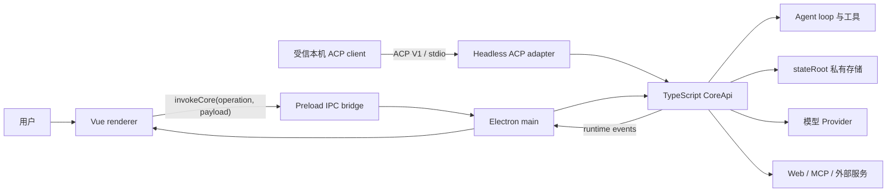

# Emperor Agent 架构总览

> 文档状态：Active 
> 面向读者：维护者、开发者、希望理解产品边界的用户 
> 最后核验：2026-07-19 
> 事实源：`packages/core/src/api/core-api.ts`、`desktop/src/main/`、`desktop/src/preload/`、`desktop/src/renderer/src/`

Emperor Agent 的桌面主产品是本地单用户 Electron 应用。Electron main 进程内创建一个 TypeScript `CoreApi` host；Vue renderer 只能通过 preload 暴露的 IPC contract 请求 Core，并通过 runtime events 接收过程状态。源码还提供默认不随桌面安装包开放的 ACP V1 stdio operator preview，它为受信本机 client 创建独立的 TypeScript `CoreApi` host。当前产品主线没有 Python runtime、Python CLI、HTTP backend 或 WebSocket backend。

主 renderer 与桌宠 renderer 都显式启用 Electron sandbox、context isolation，并关闭 Node integration。主 preload 是经过构建与 ASAR 双重审计的单文件 CommonJS，只允许加载 Electron preload polyfill；它不能运行时导入 Core 或 Node builtin。Main 仍以真实 operation allowlist、参数 schema、sender webContents、top frame 和受信 `app://` host 重新授权，preload 的 TypeScript 类型不构成信任边界。桌宠使用独立的最小 IPC bootstrap/close policy，不能调用通用 Core bridge，也不直接读取文件系统。

## 系统边界

“本地运行”指应用、Core、会话存储和工具调度位于用户设备上，不代表完全离线。模型输入会发送给用户配置的 Provider；Web、MCP 或外部消息能力被调用时，也可能连接第三方服务。

## 主要层次

| 层次              | 责任                                                                      | 主要位置                                                   |
| ----------------- | ------------------------------------------------------------------------- | ---------------------------------------------------------- |
| Renderer          | 界面、用户输入、纯 runtime projection 与可取消 effect，不持有权威业务状态 | `desktop/src/renderer/src/`                                |
| Preload / IPC     | 限定 renderer 可调用的 operation 和可订阅事件                             | `desktop/src/preload/`、`desktop/src/main/core-host.ts`    |
| CoreApi           | 进程内 API 门面、输入校验、服务组合与 mutation guard                      | `packages/core/src/api/`                                   |
| ACP adapter       | 有界 stdio、稳定 V1 request、Build 会话绑定、事件白名单投影和取消         | `packages/core/src/acp/`                                   |
| Agent runtime     | 上下文构建、模型回合、工具执行、压缩、Ask / Plan 暂停                     | `packages/core/src/agent/`                                 |
| Extension policy  | AgentDefinition schema、source/trust/precedence 与冲突诊断                | `packages/core/src/extensions/`、`templates/subagents/`    |
| Config resolution | 分层值、来源、信任、覆盖轨迹与 secret 脱敏快照                            | `packages/core/src/config/resolver.ts`                     |
| Domain services   | Session、Memory、Code Intelligence、Scheduler、Goal、Team、MCP 等领域逻辑 | `packages/core/src/<domain>/`                              |
| Lifecycle         | required service 的 reconcile/start/ready/逆序 stop 与 deadline           | `packages/core/src/runtime/lifecycle.ts`                   |
| Process runtime   | 子进程 owner/lease、stdio、配额、进程树取消与崩溃孤儿回收                 | `packages/core/src/processes/`                             |
| Stores            | `stateRoot` 下的文件持久化、事件账本和可重建投影                          | 各领域的 `store` / `repository`                            |
| Provider / Tools  | 外部模型调用与受策略约束的本地或联网能力                                  | `packages/core/src/providers/`、`packages/core/src/tools/` |

## 一次会话请求

1. Renderer 提交 `chat.submit`，附带 session、文本、附件和可选 Skill。
2. CoreApi 校验 payload，并把请求交给 `ChatService` / `MainlineTurnService`。
3. `AgentLoop` 激活 session，从 Store 重建会话、记忆、项目规则、Plan 和 Goal 上下文。
4. `AgentRunner` 通过 `SamplingCoordinator` 调用当前激活的模型；coordinator 独占 request/attempt、重试 deadline 和 abort。模型可以回复，也可以提出工具调用。
5. 工具先经过 schema、权限管线和 workspace policy；安全调用按组并发，不安全/独占调用形成完整屏障；每个 queued 调用必须收敛到唯一 terminal。命令另经 OS containment capability，并由 `OwnedProcessRuntime` 绑定 session/task owner、lease、输出配额和最小 receipt；required backend 不可用时 spawn 前 fail closed。需要 Ask 或 Plan 时，本轮安全暂停。
6. `dispatch_subagent` 由 `SubagentSupervisor` 建立 owner session、父子关系、前台/后台、TTL、并发、token/output 和 workspace lease，再由 `TaskRuntimeRegistry` 绑定磁盘 record 与内存 AbortController；取消贯穿模型、工具、进程和 MCP，晚到结果受 revision/CAS 阻止。
7. Core 把历史、checkpoint 和 runtime events 写入 `stateRoot`，renderer 只消费白名单化投影。

后台入口如 Scheduler、Goal continuation 和 Team 任务会复用同一条主线 turn 服务，不拥有另一套绕过权限的 runtime。主线由 `SessionRuntimeManager` 路由到 owner session actor：同 session mailbox 严格串行，不同 session 可并行；桌面当前选中的 `activeSession` 不是后台执行所有权。

Headless ACP 的 `session/prompt` 也进入同一个 `chat.submit` / mainline turn。`session/new` 只能创建 canonical workspace 的 Build 会话，`session/load` 先从持久 runtime ledger 做无副作用回放，再返回响应。ACP client 不能提供 MCP command 或 `additionalDirectories`，只能使用 Emperor 受信配置已经解析出的能力。同一 session 的 prompt 串行、跨 session 可并行；session cancel、协议 request cancel、连接关闭和 Core shutdown 汇入同一 AbortSignal 链。wire 输入、投影内容、并发、request ledger 都有硬上限，终态之后的迟到事件不会再发送。具体协议面见 [Headless ACP operator preview](../development/headless-acp.md)。

Core 启动由 `LifecycleSupervisor` 管理。首批 required service 是 ProcessRuntime、CodeIntelligence、TaskRuntime、SubagentSupervisor、SessionRuntime、MCP 和 Scheduler；每项按依赖顺序执行 reconcile/start/ready，全部 ready 后 Core host 才可接收 operation。CodeIntelligence 默认关闭且启动阶段不扫描 workspace；关闭时先收口 LSP/派生 cache，再由 ProcessRuntime 最后关闭全部 owned process。ProcessRuntime 最先核对上次崩溃留下的稳定 PID identity。partial start 会逆序补偿，关闭也按依赖逆序且每项有 deadline；未 ready 或已经 stopping/stopped 时返回结构化 `core_unavailable`，不能接收随后会丢失的 turn。

MCP service ready 与单个外部 server ready 是两层状态。`MCPConnectionSupervisor` 为每个 server 管理 generation/client identity、auth/health、工具快照、request abort/timeout 和有界重启；stdio server 由 owned transport 通过 ProcessRuntime 创建，断开时取消完整进程组，应用崩溃后也不盲目重连旧 PID。配置 diff 不重启未变化的健康连接，旧 generation 的迟到事件不能覆盖 replacement。`mcp.status`、Diagnostics 和插件页显示同一明确状态。

子代理定义由版本化 `AgentDefinition` manifest 驱动，`ExtensionResolver` 在 materialize 前统一计算 source identity、trust、优先级、canonical path 和 collision diagnostics。builtin/verified-plugin/user/trusted-project/managed 的顺序固定，未信任 project 和未验证签名 plugin 不激活；session 只能继续收紧 tool/Skill/Hook/MCP/model/memory/completion/sandbox policy。当前自动发现面只包含内置 manifest 和可选的全局 user manifest，不存在未签名 marketplace 或项目目录静默提权。

跨领域的配置解释由 `ConfigResolver` 提供统一的 `Resolved<T>`，显式区分 builtin、user、project、session 和 managed。顺序不依赖 loader 输入次序，managed 最后应用；untrusted project 默认不能替换值，只有声明了专用 restriction reducer 的 key 才能接受单向收紧。当前接入 permission、runtime/AgentDefinition sandbox、MCP、当前 session 的 Skills 和 AgentDefinition；旧 `emperor.local.json`、`mcp_config.json`、Skill 目录与 manifest 仍是事实源，没有新增统一配置文件或破坏性迁移。

长期记忆检索另有默认关闭的 `memory.hybrid` 能力，取值为 `off | eval | on`。它从 Markdown 权威记忆重建全文与向量派生索引，检索时组合 BM25、向量相似度、时间衰减、source 权重和 MMR，并在 embedding 失败时降级到全文检索。`eval` 只执行影子检索和诊断，不改变 prompt；`on` 也只有在当前 embedding provider 与通过的离线评估 receipt 精确绑定时才允许改变 prompt，否则有效模式自动降为 `eval`。当前发行物没有内置生产 embedding provider，因此默认配置不会启用 prompt 注入。

Code Intelligence 也是默认关闭的 `off | eval | on` 能力。它以 lazy TypeScript extractor、single-owner mailbox、immutable COW snapshot 和可重建 gzip cache 提供受界定义/引用查询；受管文件工具成功后提交增量 event，外部编辑在查询前 refresh。图层硬限制为 200 个文件、累计 5 MiB 源码和单文件 5 MiB，超过时结果明确标记 partial，并由 grep 或受信 LSP 兜底。LSP descriptor 只能由 composition root 注入，进程经 `OwnedProcessRuntime` 绑定 session owner、只读 workspace、禁网、协议大小与三次重启上限。只有 parser-bound benchmark receipt 匹配的 `on` 才会在 Build session 注册 `code_intelligence`；Chat、project manifest、renderer 或模型参数都不能自行启用或覆盖 workspace。当前发行组合根没有 production LSP descriptor/发行 receipt，因此默认不会暴露该工具。

Renderer 不在 runtime reducer 中调用 IPC 或启动 timer。Session、Task 与 replay 先经过各自的纯 action reducer；subscription、pending clear 和 memory refresh 作为 domain-local effect 执行，并把 success/error/cancel/timeout `TaskResult` 重新送回 reducer。历史 replay 复用相同 projection，但 effect 列表固定为空，因而不会在打开旧会话时重放 refresh、toast 或定时清理。

## 权威状态与投影

系统不把 renderer、模型回复或 Todo 卡片当作权威状态：

- Session 历史和 checkpoint 由 Core 持久化。
- Plan、Ask、权限决定和 Goal 由各自 Store 管理。
- Runtime event 是界面恢复用的投影，不替代领域账本。
- Goal 只有 Completion Gate 可以写入 `completed`。
- `stateRoot` 与应用资源所在的 `runtimeRoot` 相互独立。

详细数据布局见[全局私有存储根](global-state-store.md)，Goal 的事件账本和恢复协议见[Goal 模式架构](goal-mode.md)。

## 扩展约束

- 新 Core 能力先进入对应 domain service，再由 CoreApi 暴露，不能直接把 store 暴露给 renderer。
- 新 IPC operation 需要同步 CoreApi、main contract、preload、renderer API 和测试。
- 新 runtime event 需要同步 Core 类型、renderer 类型、纯 reducer / domain effect、handler 和无副作用 replay。
- 新 ACP method 或 capability 必须先实现 schema、权限、限额、幂等、取消和 wire / Core E2E，再修改 initialize 声明；不允许把 client 输入变成配置或 executable authority。
- 新工具必须经过统一 registry、输入 schema、权限与 workspace policy。
- 新持久数据必须定义位置、权限、原子写入、恢复和兼容策略。
- 不恢复 Python、HTTP 或 WebSocket 的产品主链路。

具体执行清单见[扩展 Emperor Agent](../development/extending-emperor.md)。
