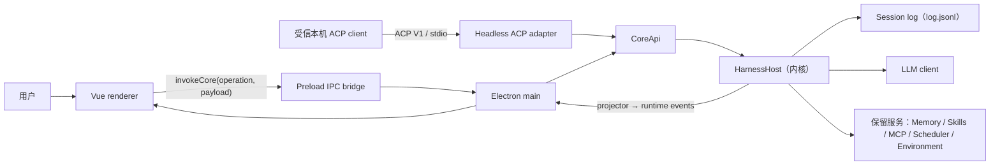

# Emperor Agent 架构总览

> 文档状态：Active 
> 面向读者：维护者、开发者、希望理解产品边界的用户 
> 最后核验：2026-09-23 
> 事实源：`packages/core/src/harness/host/host.ts`、`packages/core/src/api/core-api.ts`、`packages/core/src/api/operations.ts`、`desktop/src/main/`、`desktop/src/preload/`、`desktop/src/renderer/src/router.ts`、`desktop/src/renderer/src/components/shell/`、`desktop/src/renderer/src/components/workspace/`

Emperor Agent 的桌面主产品是本地单用户 Electron 应用。Electron main 进程内创建一个 TypeScript `CoreApi`；`CoreApi` 背后是唯一的内核组合根 `HarnessHost`。Vue renderer 只能通过 preload 暴露的 IPC contract 请求 Core，并通过 runtime events 接收过程状态。源码还提供默认不随桌面安装包开放的 ACP V1 stdio operator preview，它为受信本机 client 创建独立的 `CoreApi`。产品主线没有 Python runtime、HTTP backend 或 WebSocket backend。

`@emperor/core` 是受控的内部宿主接口。Electron 和 ACP 只能从 `@emperor/core/api`、`@emperor/core/runtime-contract` 或 `@emperor/core/host-capabilities` 导入；runtime contract 保持 browser-safe，不拉入 Node store 实现。

主 renderer 与桌宠 renderer 都启用 Electron sandbox、context isolation，并关闭 Node integration。主 preload 是单文件 CommonJS，只允许加载 Electron preload polyfill。Main 以 operation allowlist、参数 schema、sender webContents、top frame 和受信 `app://` host 重新授权每次调用；preload 的 TypeScript 类型不构成信任边界。

## 系统边界

```mermaid
flowchart LR
  User["用户"] --> Renderer["Vue renderer"]
  Operator["受信本机 ACP client"] -->|"ACP V1 / stdio"| Acp["Headless ACP adapter"]
  Renderer -->|"invokeCore(operation, payload)"| Preload["Preload IPC bridge"]
  Preload --> Main["Electron main"]
  Main --> Core["CoreApi"]
  Acp --> Core
  Core --> Host["HarnessHost（内核）"]
  Host --> Log["Session log（log.jsonl）"]
  Host --> LLM["LLM client"]
  Host --> Kept["保留服务：Memory / Skills / MCP / Scheduler / Environment"]
  Host -->|"projector → runtime events"| Main
  Main --> Renderer
```

“本地运行”指应用、内核、会话存储和工具调度位于用户设备上，不代表完全离线。模型输入会发送给用户配置的 Provider；MCP、Skill 脚本或会联网的命令被调用时，也可能连接第三方服务。

## 主要层次

| 层次          | 责任                                                                                               | 主要位置                                                      |
| ------------- | -------------------------------------------------------------------------------------------------- | ------------------------------------------------------------- |
| Renderer      | 界面、用户输入、纯 runtime projection 与可取消 effect，不持有权威业务状态                          | `desktop/src/renderer/src/`                                   |
| Preload / IPC | 限定 renderer 可调用的 operation、可订阅事件和少量桌面能力（文件选择、打开文件夹、内置浏览器视图） | `desktop/src/preload/`、`desktop/src/main/core-host.ts`       |
| CoreApi       | 进程内 API 门面、输入校验、mutation guard、工作台与配置服务                                        | `packages/core/src/api/`                                      |
| HarnessHost   | 组合 LLM、session log、Agent loop、工具、沙箱、审批、Plan、压缩、Hooks、Goal、子代理               | `packages/core/src/harness/host/`                             |
| Agent loop    | turn → step 循环、inbox、工具调度、middleware                                                      | `packages/core/src/harness/agent/`                            |
| Session log   | 每个 session 一份 append-only `log.jsonl`、崩溃修复、fork                                          | `packages/core/src/session-log/`                              |
| LLM           | Provider catalog、model route、DeepSeek / pi-ai 适配器、重试策略                                   | `packages/core/src/llm/`                                      |
| 工具          | 内置工具、注册表、执行管线、大结果落盘                                                             | `packages/core/src/harness/tools/`                            |
| 权限          | 沙箱模式、审批策略、权限预设、一次性提权                                                           | `packages/core/src/harness/sandbox/`、`harness/approval/`     |
| 保留服务      | Session 索引、Memory、Projects、Skills、Plugins、MCP、Scheduler、Watchlist、环境探测               | `packages/core/src/<domain>/`、`harness/host/services.ts`     |
| Workspace     | 右侧工作台与环境信息卡的 Snapshot、Git、只读 Files、用户直控 Terminal；全局只读 Pull Request 查询  | `packages/core/src/workspace/`、`desktop/src/main/terminal-*` |
| Projection    | Session log → renderer runtime event 的纯折叠                                                      | `packages/core/src/harness/projection/`                       |
| ACP adapter   | 有界 stdio、V1 request、Build 会话绑定、事件白名单投影和取消                                       | `packages/core/src/acp/`                                      |

## 一次会话请求

1. Renderer 提交 `chat.submit`，附带 session、文本、附件和可选 Skill。草稿 session 在第一条消息时才被提升为真实 session。
2. `ChatService` 把请求交给 `HarnessHost.submit()`：先在 session log 写入仅供界面使用的 `host/user-meta`，再把用户消息放入该 session Agent 的 inbox（`followup`，或运行中插话时 `steer`）。
3. `Agent` 空闲时启动驱动循环：一个 turn 由若干 step 组成；每个 step 认领 inbox、执行 pre-step middleware（工作区说明、长期记忆、Skill 目录、压缩、Hooks、Goal、Plan）、从 session log 推导模型请求并调用 LLM。
4. 模型的流式输出逐块写入 log。模型提出工具调用时，`ToolRegistry` 依次执行参数校验、pre-execute middleware（Hooks）、审批、guard、工具体、post-execute middleware（重复提醒、大结果落盘、Hooks）。并发安全的调用可重叠执行，其余调用形成屏障，结果按模型顺序提交。
5. 需要用户介入的调用（`ask_user_question`、`exit_plan_mode` 审批、一次性提权审批）在工具调用内部阻塞，直到用户在界面回答、取消或 turn 被中止。
6. 没有工具调用且 inbox 为空时 turn 结束。内核没有最大步数限制。
7. `SessionProjector` 把每条 log 事件折叠为 renderer runtime event 推给界面；刷新或重启时用同一折叠重放整份 log。

模型可见内容与 log 一一对应：凡是进入模型请求的内容都已写入 log，没有写入 log 的内容不会进入请求。详细执行链路见 [Agent 执行链路](agent-runtime.md)。

## 后台入口

Scheduler 的 `agent_turn` 任务、Watchlist 检查和 Goal 续跑都通过同一个 `HarnessHost.submit()` / inbox 进入目标 session 的 Agent，不拥有另一套绕过权限的 runtime。每个 session 一个 Agent；同一 session 的 turn 串行，不同 session 可以并行。桌面当前选中的 session 只决定界面显示，不是后台执行所有权。

子代理在进程内运行，是独立的子 session（最大嵌套深度 3）。它们继承父会话的沙箱模式，审批策略固定为 `never`，因此子代理内的提权请求会被自动拒绝。

## 桌面外壳与路由

Renderer 外壳是 `components/shell/AppFrame.vue` 的三栏网格：左侧会话栏、中间列、右侧工作台。列宽由 `components/shell/columns.ts` 的纯函数 `computeColumns()` 求解：中间列有下限（对话 480px、轨迹 640px），空间不足时右侧工作台先在 360–960px 内缩窄，再自动关闭；这一让位只作用于渲染宽度，不改写用户的宽度偏好，窗口变宽后恢复。窗口宽度小于 1024px 时侧栏收起为 56px 图标栏。

布局偏好由 `components/shell/frameState.ts` 管理，按窗口保存在 renderer 的 `localStorage`（键 `emperor.frame.v2`）：侧栏宽度、工作台开关与宽度、当前工作台面板（`launcher` / `review` / `terminal` / `files` / `browser`）、环境信息卡开关，以及轨迹「详情」列的开关与宽度。旧的 `emperor.frame.v1`（右侧详情栏）在首次读取时迁移一次后删除。

路由定义在 `desktop/src/renderer/src/router.ts`，每个页面组件单独分包，并由 `<keep-alive :max="6">` 缓存：

| 路由                                               | 页面                                       | 右侧工作台 |
| -------------------------------------------------- | ------------------------------------------ | ---------- |
| `/chat/:sessionId?`、`/chat/:sessionId/trajectory` | 对话与轨迹（`ConversationView`）           | 可用       |
| `/scheduler`                                       | 定时任务                                   | 不显示     |
| `/capabilities/:tab(plugins\|skills\|mcp\|tools)?` | 能力（插件 / Skills / MCP / 工具四个标签） | 不显示     |
| `/pulls/:owner?/:repo?/:number?`                   | Pull Request                               | 不显示     |
| `/explore`                                         | 探索                                       | 不显示     |

设置弹窗由当前路由上的 `?settings=<分区>` 查询参数打开，对话页和整页都可以叠加它。定时任务、插件、Skills、MCP 与工具已从弹窗移到整页：`?settings=scheduler|plugins|skills|mcp|tools` 由全局 `beforeEach` 守卫转到对应页面，旧的 `/plugins/:tab?` 转到 `/capabilities/:tab`，`/skills/:name?` 转到 `/capabilities/skills?skill=<name>`，`/mcp`、`/tools` 转到对应标签；原「配置」分区并入“记忆 › 用户档案”，`?settings=configs` 打开「记忆」；其余旧的独立设置路由仍转成 `/chat?settings=<分区>`。

快捷键是 `desktop/src/renderer/src/shortcuts.ts` 中的一张纯映射表，由 `composables/useShortcuts.ts` 在捕获阶段安装唯一的 `keydown` 监听；有弹窗时不响应，并避开 Electron 默认菜单占用的组合键。侧栏通知由 `runtime/notifications.ts` 的纯 reducer 从 runtime event 推导，只保存在 renderer 本地，不经过 Core，也不发送系统通知。

## 右侧工作台与环境信息卡

右侧工作台（`components/workspace/WorkspacePanel.vue`）提供启动器和四个面板：审查、终端、文件、浏览器，每个面板单独分包。对话组件通过 `workspaceState.ts` 的 `requestWorkspace({ pane, paths?, file?, url?, focus? })` 请求打开某个面板或内容，不持有组件引用。环境信息卡（`components/conversation/environment/EnvironmentCard.vue`）浮在对话区右上角，输入框上方的变更汇总条显示工作区 Git 改动总计；工作台、环境信息卡和变更汇总条共用 `useWorkspaceSnapshot.ts` 中按引用计数轮询的同一份 `workspace.snapshot`。

- `workspace.snapshot` 聚合 Git/worktree/安全操作凭据、当前 Goal、后台任务、子代理和终端的投影。
- 审查使用 Core 内的 Git 分层服务；环境信息卡的「比较分支」通过 `git.remote` 取得 `origin` 的网页地址。
- 文件是只读、有界的项目文件浏览。
- 终端的 PTY 由 Electron main 注入 Core `TerminalService`。它是用户直接操作的系统 Shell，不进入 Agent loop 或 Agent 权限，也不写聊天记录或 session log。
- 浏览器不经过 CoreApi：Electron main 的 `BrowserViewHost`（`desktop/src/main/browser-view.ts`）在内存分区中托管一个 sandboxed `WebContentsView`，只加载经 `browser-view-policy.ts` 规范化的、用户在地址栏提交的 `http(s)` 地址，拒绝全部权限请求、下载和应用内弹窗。
- 「Pull Request」整页通过 `pullRequests.*` 调用签名工具目录中的 `gh`，不绑定会话或项目，只读。

这些入口都不是 renderer 的本机权限旁路：Git 根、路径、revision、确认和浏览器地址由 Core 或 Electron main 校验。Trajectory 的「详情」列（Inspector）是轨迹视图内部的一列，不属于右侧工作台；对话中的 Inspect 跳转到 `/chat/:id/trajectory?call=<callId>` 并打开这一列。

## Headless ACP

ACP 的 `session/prompt` 也进入同一个 `chat.submit`。`session/new` 只能创建绑定既存目录的 Build 会话；`session/load` 先从 session log 投影回放，再返回响应。ACP client 不能提供 MCP command 或额外目录，也不能回答交互。协议面见 [Headless ACP operator preview](../development/headless-acp.md)。

## 权威状态与投影

- Session log 是会话内容、权限选择、Plan 状态、Goal、审批和问题记录的唯一事实源。
- Runtime event 是界面投影，可以随时从 log 重建，不替代 log。
- Memory、Projects、Skills、Scheduler、MCP 等保留服务各自持有自己的文件事实源。
- Skills 与 MCP 配置有两条写入路径：界面经 CoreApi 的 `skills.*` / `mcp.*`（受 mutation guard 保护），Agent 经 `skill_manage` / `mcp_config` 工具（`danger-full-access` 以外每次写入都要审批）。两条路径共用 `skills/library.ts` 与 `mcp/manage.ts`，写入后分别刷新 Skill 目录或重载 MCP。
- `stateRoot` 与应用资源所在的 `runtimeRoot` 相互独立。

数据布局见[全局私有存储根](global-state-store.md)，权限与 Plan 见[权限与 Plan 架构](control-and-permissions.md)，Goal 见 [Goal 架构](goal-mode.md)。

## 扩展约束

- 新 Core 能力先进入对应内核模块或保留服务，再由 CoreApi 暴露，不能直接把 store 暴露给 renderer。
- 新 IPC operation 需要同步 `operations.ts`、CoreApi、main contract、preload、renderer API 和测试。
- 新 runtime event 需要同步 `harness/projection/*`、wire 名单和 renderer runtime。
- 新工具在 `harness/tools/builtin/` 实现，在 `HarnessHost.compose()` 注册。
- 新持久数据必须定义位置、原子写入、恢复和兼容策略。
- 不恢复 Python、HTTP 或 WebSocket 的产品主链路。

具体清单见[扩展 Emperor Agent](../development/extending-emperor.md)。
