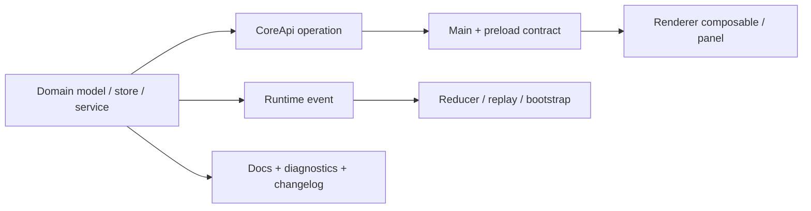

# 扩展 Emperor Agent

> 文档状态：Active 
> 面向读者：Core、Electron 与 renderer 开发者 
> 最后核验：2026-07-21 
> 事实源：当前 CoreApi / IPC / runtime event / domain service 分层与 `AGENTS.md`

Emperor Agent 的扩展通常横跨 Core、Electron contract、renderer 投影、持久化和文档。先确定权威状态属于哪个领域，再从 domain service 向外接入；不要把策略散落到组件或 prompt 文案。

## 通用顺序

1. 定义用户入口、失败语义、权限和成熟度。
2. 确定权威状态、schema、Store 位置与恢复方式。
3. 在对应 `packages/core/src/<domain>/` 实现 model / store / service。
4. 由 CoreApi 暴露最小 operation，并接入 validation 与 mutation guard。
5. 同步 Electron main contract、preload 和 renderer API。
6. 需要异步投影时增加 runtime event、reducer 和 replay。
7. 加测试、诊断、用户文档、架构文档和 changelog。

## 新 Provider 或模型字段

- 在 Provider registry / factory 增加实现，不从 renderer 拼接未经验证的 endpoint 或请求体。
- 更新 `model-config` schema、迁移、credential 解析和 availability 诊断。
- 当前模型配置契约是 schema v2：可以保存多个条目，但只有一个全局 `activeModelId`。
- `models[].pricing` 和顶层 `policy` 都是可选、默认关闭的用户配置。不得内置会过期的价格、从模型顺序推断 fallback，或把缺失 cost 当作 0。修改 schema 时同步 ModelService、`model.savePolicy` operation、renderer 模型面板、ConfigResolver provenance、TokenTracker 和 runtime event 类型。
- 跨模型调用只能接在 SamplingCoordinator 的 terminal 之后；新增 trigger 时必须证明不会对 auth/schema/context/billing/content-filter/unknown 做隐式切换。切换前只清理 provider projection 的模型绑定 reasoning/signature，不能改写 canonical history；provisional stream/tool callback 必须有提交或丢弃边界。
- Provider SDK 的 retry 必须保持 0；网络、429、5xx、Retry-After、deadline 和 abort 只能由 `SamplingCoordinator` 消费统一预算。请求形状兼容恢复只能更新 provider capability，再由 coordinator 发起并记录下一 attempt，禁止在 provider 内隐藏二次提交。
- 新增长任务不能只写 `TaskManager` 状态后同步等待 Promise。先创建 durable Task，再交给共享 `TaskRuntimeRegistry`；执行入口必须接收 parent `AbortSignal`，terminal transition 必须带捕获的 revision，输出写 `TaskOutputStore` 并保留 cursor、配额和 symlink 边界。重启时只 reconcile 本 runtime 拥有的 Task，不能抢占 Plan、Scheduler 等领域自己的恢复语义。
- 新增长生命周期服务必须用小型 `LifecycleService` adapter 声明稳定 ID、required、依赖和 `reconcile/start/ready/stop`，再纳入 `LifecycleSupervisor`。`start`/`stop` 必须幂等；partial start 的 `stop` 要能清理半初始化资源；`stop` 必须响应 signal，或由 supervisor deadline 放行后续依赖继续关闭。不要在 `AgentLoop.create()` / `close()` 追加零散启动顺序。
- 新增命令、Hook、MCP stdio、LSP 或 terminal 子进程必须由 composition root 注入 `OwnedProcessRuntime`，声明 owner、cwd capability、containment、timeout 和 output quota；不得在领域模块直接 `child_process.spawn`，也不得把裸 PID 当 lease。长生命周期 stdio 使用受管 handle，磁盘只写脱敏 receipt；新增 reparent 路径必须验证 current lease 与同 session owner，启动恢复必须验证 boot marker + stable start identity 后再 kill，不能重新 attach 旧 handle。
- 新的 MCP tool 调用必须继续把 request ID、`ToolExecutionContext.signal` 和有界 timeout 传到 SDK `RequestOptions`；连接 generation、重连和 client replacement 属于 MCP supervisor，不能通过吞掉 abort 来简化。不得在 transport 失败后自动重放未知副作用的 tool call；大结果继续由 ToolRegistry 截断并写入 `memory/tool-results/`，不能直接塞进 event 或模型上下文。
- 修改 MCP supervisor 时必须覆盖旧/新 client race、未变化配置保活、并发 restart singleflight、1/4/16 秒退避上限、认证失败不自旋、连接/调用 timeout、elicitation abort 和大结果 exact artifact。状态面同步 `mcp.status`、bootstrap、Diagnostics、`mcp_connection_state` 与插件页。

## 新 AgentDefinition / Extension source

- 内置子代理事实源是 `templates/subagents/agents.json`；修改内置定义必须同步对应 prompt、`desktop/scripts/before-pack.cjs` / `desktop/electron-builder.yml` 资源 allowlist、legacy name/alias/tool behavior 测试和 Active 文档。不要把定义重新散回 `SubagentRegistry` 常量。
- Definition `schemaVersion=1` 必须完整声明 model、tools、skills、hooks、mcp、memory、completion、sandbox 与 delegation。schema strict；新增字段先在 `packages/core/src/extensions/resolver.ts` 建模、验证和定义收紧关系，不能用透传 `Record<string, unknown>` 绕过。
- source descriptor 的 kind/trust/signature/readOnly 只能由可信 host 注入。固定 precedence 是 builtin < verified plugin < user < trusted project < managed；不要从 manifest 读取 rank 或 trust。当前 composition root 自动启用 builtin 和存在时的 `stateRoot/agents/agents.json`；其他 source 要等独立 trust/安装入口提供 descriptor，不能扫描项目或 marketplace 后直接激活。
- prompt 与 manifest 必须是 source root 内的非 symlink regular file；保留 traversal、Windows absolute path、realpath escape、canonical duplicate、同名/alias collision、损坏 JSON、单 entry invalid isolation 与大小/数量上限测试。诊断只返回稳定 code/path/source/name，不得回显未知 command、URL、header 或其他被拒绝值。
- plugin 必须同时具备 host trust 和 verified package signature。Agent manifest 只能引用 MCP server ID / Hook ID / Tool ID，不能嵌入 shell、URL、argv、transport、credential、LSP 或 MCP process 配置。
- `applyAgentSessionPolicy()` 只能收紧：allowlist 交集、turn 上限取小、memory/sandbox 取严格。运行时 materializer 还必须对 model profile、Skill、Hook、MCP server 和 sandbox fail closed；Permission/workspace/OS sandbox 永远可以进一步拒绝。

## 新配置层或 Config key

- 不要新造另一套 `source` / `rank` / provenance。使用 `packages/core/src/config/resolver.ts` 的 `ConfigResolver` 与 `defineConfigKey()`；builtin、user、project、session、managed 的稳定次序由 resolver 统一维护。
- 普通 key 对 untrusted project 默认 reject。确有单向收紧语义时必须单独实现 `restrictUntrustedProject`；不要复用普通 merge 后在调用方补 if。allowlist 用交集，deny/require 用安全 lattice，managed constraint 必须最终生效。
- 旧 JSON、目录和 manifest 保持各自 writer 与 schema，只增加输入 adapter。除非另有经过迁移/回滚审核的任务，不要把 `emperor.local.json`、`mcp_config.json`、Skill 或 AgentDefinition 合并成一个文件。
- Secret 路径必须在 key 上显式声明。effective snapshot 只能返回 `[REDACTED]`、source 和基于脱敏值的 fingerprint；不得把 secret、原始 credential 或可恢复值写进 runtime event、诊断错误或覆盖轨迹。
- 新 key 同步 `CoreEffectiveConfigService`、`config.effective` contract、Diagnostics renderer 类型/投影和表驱动测试。测试至少覆盖全部层组合、同层确定性、untrusted restriction、managed clamp、旧 loader 等价与序列化后无 secret。
- 子代理 Task 要保留 definition revision 与 source ID/kind/trust；新增 source 必须同步 Diagnostics `agentDefinitions`，以便用户区分“没有 agent”和“source 被 trust/collision/schema 阻断”。
- 同步设置面板、测试连接、错误映射和用户模型文档。
- 不在日志、runtime event、诊断或截图中暴露 API key。

## 新工具

- 实现统一工具 contract：稳定名称、描述、输入 schema 和有界输出。
- 在 composition root 注册；声明读写性质、权限行为，以及准确的 `concurrencySafe` / `exclusive` 调度属性。只有能证明无共享可变状态、无顺序依赖的工具才能标记为并发安全；不安全或独占工具是完整屏障，必须等待之前的安全组并阻止后续调用提前执行。
- 文件路径必须走 workspace policy；shell 需要可靠的只读判断，无法证明时按受控操作处理。
- 新增 shell/terminal/command-hook 入口必须复用 `analyzeShellCommandFailClosed` 与 `ShellCommandAnalyzer` capability。allow 只能来自单命令、无 redirect/env/dynamic/compound 且 flags 通过正向证明的 AST；旧 regex/token resolver 只能收紧。parser exception、invalid adapter result、复杂度上限和未知结构必须在 spawn 前转 Ask 或 deny，禁止降级为字符串首词 allowlist。
- 新增权限来源通过 `PermissionRuleLayerInput.source` 由可信 composition root 注入，不得让 project/local rule 内容填写自己的 trust。规则解析后保留 source、candidate 和 precedence；任何新策略层都要覆盖 `deny > ask > allow`、同 action trust 顺序、引号混淆、命令边界和低信任层不可放宽测试。
- 新工具必须兼容 Runner 两阶段批量预检：schema、Guard、PreToolUse、workspace 和 Permission 在副作用前完成；批次中任一失败不得让其他调用先执行。PermissionRequest Hook 的 `allow` 不能替代用户审批，updated input 必须触发整批重新判权。
- Permission interaction 只能公开 v2 安全摘要和稳定 option ID。fingerprint、normalize 后参数、规则 trace/explanation 与一次性凭据只能进入私有 PermissionRequestStore/Diagnostics；不得新增 renderer 或 runtime event 字段泄漏这些数据。
- Permission allow 与 OS containment 必须分开建模。新的命令入口复用 `OwnedProcessRunner` 与 `ProcessContainmentReceipt`；不得直接 `spawn`/`exec` 后声称 sandboxed。`run_command` 一律使用 required，backend unavailable/error/unsupported 或 runner 返回 `unsandboxed` 时 fail closed；如其他只读诊断入口确需 preferred，必须独立建模、记录真实 receipt，不能借此放宽 `run_command`。
- 扩展 sandbox backend 时同步 capability probe、固定 argv/profile 生成、stateRoot 隐藏、workspace 外读写、symlink、子进程、network 和 backend-missing 测试。profile/helper 不接受 renderer、模型或远程配置提供的命令、路径模板或 argv。
- 联网工具把外部内容视为不可信输入，不把网页或 MCP 返回值当作系统指令。
- 产物进入受管 attachment / media store，不把任意绝对路径直接交给 renderer。
- 若结果能成为 Goal evidence，还需定义 Core observation eligibility，不能让模型自报 PASS。
- 执行实现必须使用调度器提供的 child `AbortSignal`，不能缓存父 signal 或忽略取消。不得自行补写 `tool_run_*` 终态；调度器负责 queued 到恰好一个 completed / failed / cancelled 的转换，以及流式 partial 被最终响应删除时的 tombstone。
- 测试至少覆盖正常完成、失败、父取消、partial straggler、并发安全组和不安全屏障；改变调度器时必须保留一万序列性质测试的零重叠、结果有序与终态唯一断言。

## 新 CoreApi operation

- Handler 只编排 service，不在 API 门面复制领域逻辑。
- 输入在 Core 边界做 runtime validation，不能只依赖 TypeScript。
- Mutation 接入 pending Ask / Plan 与领域 guard；owner session 必须明确。
- 同步 main operation allowlist、preload 类型、renderer API 和 contract test。
- 错误使用稳定 code 与安全消息，不回传堆栈、凭证或任意本机路径。

右侧项目工作台 operation 还要遵守以下边界：

- Git/Files/Terminal 从 `sessionId` 解析受信 Build workspace，不接受 renderer 提供的 root/cwd 作为授权依据；Git 参数使用无 Shell argv 和 `--`，Renderer path 始终相对 Build project，monorepo 映射与越界 staged 检查留在 Core。Git 分层保持 Repository Resolver、Hardened Runner、Status/Diff、Mutation、Worktree、Pull Request 与 Receipt Store 边界；不要把仓库识别、`gh` 或凭据逻辑塞回 Renderer。Git/Agent mutation 按当前 session binding 的 canonical worktree 共享串行域；排队 writer 必须响应 AbortSignal，直接写工具在副作用前再次检查取消。仓库子目录 Build 不得执行无法收窄到 project pathspec 的仓库级 mutation。
- Files 先做 relative path、realpath、symlink containment、大小和 MIME 限制；`.git` 永不成为可浏览数据。目录列表和全仓搜索都必须异步让出事件循环、具有硬扫描上限和短期分页缓存，不能让 cursor 翻页重复阻塞扫描大型仓库；达到上限时公开 `truncated`，不得伪装成完整结果。
- Terminal 高频输出使用专用非持久 IPC channel，不新增 runtime event；Core 保持 terminal owner、序号、严格字节缓冲和关闭权，Main 只向受信 Renderer 当前订阅的 session/terminal 批量投递，并保留批次内每个输出事件的 `seq` 边界。Terminal 只能是用户直控入口，绝不能作为 Agent、Hook 或网页绕过 Permission/containment 的进程 API。
- 新增 Electron 原生模块时同步 `electron.vite.config.ts` externalize、builder files/asarUnpack 精确白名单、after-pack 审计、目标 Electron ABI smoke 和三平台 candidate 构建；不得用打包整个依赖源码来省略 runtime 文件分析。
- GitHub CLI 只有在 `tool-catalog.json` 完成来源、版本、摘要、publisher、参数、许可和三平台审核后才能注入 PR Service；未审核时返回 `git_gh_unavailable`，禁止搜索 PATH 或直接调用系统 `gh`。

## 新 Runtime event

- 确定事件是 UI 投影，不是领域权威事实。
- Payload 有界且可序列化，包含 session 归属和去重顺序；不得默认携带原始 prompt、secret 或未经筛选的工具输入/输出。
- 新的异步边界优先提供 request / attempt / task / parent task / tool call correlation ID 和稳定 idempotency key；V2 writer 仍须遵守 feature flag 迁移边界。
- 诊断事件标记 `visibility=diagnostic`，只进入本机诊断回放，不能进入模型上下文。
- 同步 Core union、main bridge、renderer `types.ts`、reducer / handler、`useRuntime`。
- 同时测试 live、replay、bootstrap、重复 event 和切换 session。
- 领域提交成功而投影失败时记录诊断，由 bootstrap 重建；不要回滚已提交终态。
- 诊断必须暴露 lifecycle 的真实 supervisor/service state；不得把 `starting`、`stop_timeout` 或 optional failure 显示成 ready。
- 修改 prompt queue/interjection 时同时覆盖 Core `chat.listQueuedPrompts` / `chat.manageQueuedPrompt`、`prompt_*` / `message_tombstoned` union、Actor 原子替换、message graph、runtime replay、renderer 队列托盘和 Composer 默认 delivery。queued 状态不得创建乐观 user 气泡；测试必须包含取消/开始/停止竞态、事件恰好一次、消息不丢失与重复 replay。

## 新 ACP method 或投影

- ACP 是同一 TypeScript Core 的本机 stdio adapter，不是第二套 Agent runtime。request handler 只能调用 CoreApi / domain service，不能复制会话、权限、模型或工具逻辑。
- `initialize` 只声明已经通过 wire 和真实 Core E2E 的稳定能力。实验方法、client fs、terminal、image/audio/resource、permission request 未实现时不得提前宣称。
- 所有 client 路径先做绝对路径、realpath、既存目录和持久 workspace 一致性校验。`mcpServers`、`additionalDirectories`、命令、permission、tool 和模型选择不能从 wire payload 进入受信配置。
- 新 request 必须接入有界 request ledger：同 method / ID / params 的精确重试共享一次 effect，冲突 ID fail closed；不得用无界 `Set` 保存永久历史。
- 同一 connection 的 outbound 由 SDK 单队列保持 notification / response 顺序。新增投影走 `AcpEventProjector` 白名单，并定义单字段、总字节、事件数、terminal tool 和连接终态边界；诊断、secret、完整 prompt、任意 tool input/output 不得默认透传。
- 取消必须把 session cancel、`$/cancel_request`、connection EOF / error 和 host shutdown 合并到 Core `AbortSignal`，等待有界 settlement 后逆序关闭。副作用状态未知时不得自动重放 prompt 或 tool call。
- 修改 transport 时继续验证 split/multi-line、非法 UTF-8 / JSON、超长未换行输入、输出背压、EPIPE 和 persistent stdin；stdout 只能承载协议，日志只写 stderr。
- 最低测试包含 adapter contract、raw JSON-RPC 重复/冲突 ID、投影终态去重、真实 Core submit/replay/cancel E2E 和构建后子进程 smoke。操作说明见 [Headless ACP operator preview](headless-acp.md)。

## Renderer Action / Effect

- Projection reducer 必须是纯函数：输入 state/action 不得被改写，不读取时间、随机数、DOM、IPC、文件或网络，也不启动 Promise/timer。事件时间和 ID 必须来自 action payload。
- 每个领域维护自己的 action/effect 类型与 reducer；当前 session、task、pending 和 runtime effect 是参考实现。不要把新增行为塞进全局巨型 effect enum、root switch 或新的万能 composable。
- IPC、timer、open/file 等副作用只能由 effect executor 运行。Effect 必须有稳定 `id`、owner/domain `key`、必要时的 `timeoutMs`，并接收 `AbortSignal`；相同 key 的新 effect 会取消旧 effect。
- Executor 不得直接改 Vue state。它只能返回可序列化 output；`ActionEffectStore` 将 success/error/cancelled/timeout 包成 `TaskResult` action，再交给 reducer。迟到 Promise 因 effect terminal fence 被丢弃。
- Live event 可以规划 effect；replay 必须只做 projection 并返回空 effect。打开历史会话时不得触发 memory refresh、Scheduler/pending timer、toast、session callback 或外部 IPC。
- 修改 session/task/replay 时保留 composable public API 的 characterization tests，并覆盖 immutable reducer、重复/乱序 seq、terminal monotonic、effect abort/timeout 和跨 session cursor。长会话门禁至少包含 1,000 条以上消息的 streaming projection、虚拟化和展开态压力测试。

## 修改 Prompt / Context

- ContextBuilder 的长期稳定输入必须显式标记 `stability: stable`；Goal、Plan、Control、clarification 等 turn/runtime 状态标记 `dynamic`。新增稳定 section 时同时定义 cache-break reason，不能让变化落入笼统 unknown。
- 保持 canonical history 只追加；microcompact、tool-result shrink、emergency shrink 和附件字节再生成只作用于 provider projection。测试必须分别断言 `canonicalHistoryHash` 与 `projectedMessagesHash`。
- Prompt snapshot 和 runtime report 只允许 hash、长度、version、source、reason code 和首个变化位置，不得写入正文、工具输出、附件数据或 provider 原始响应。
- 会进入模型调用关键路径的 memory、skills、MCP 或环境读取接入 `PromptPrefetchCoordinator`，声明 required/optional 与 timeout，接受父 `AbortSignal`；required 失败必须保留稳定领域错误并 fail closed。
- 自动语义压缩使用显式 runner option 控制，不能再与日志轮转、环境变量或 provider cache hit 绑定。保留三次失败 breaker、已提交回复不回滚和 history 副本测试。

### Hybrid Memory 评估与启用

- `emperor.local.json` 的 `memory.hybridMemory` 只能是 `off`、`eval` 或 `on`，缺失/非法值必须回到 `off`；通过 `ConfigResolver` 解释来源，未信任 project 只能收紧，不能启用。
- 新 embedding provider 必须有稳定 `id` 和固定 `dimensions`，实现批量 `embed(texts, signal)` 并尊重 abort。provider/index/query 失败必须回退 FTS；不得把原始异常、记忆正文或绝对路径写入普通 runtime event。
- 先运行 `npm run eval:hybrid-memory --workspace @emperor/core`。门禁必须证明 factual hit 提升、stale violation 降低、cross-project pollution 为零且不回归、真实 embedding 故障可降级，并记录 dataset SHA-256、延迟和派生磁盘增量。
- 离线 fixture 的通过结果不能替代生产证明。运行时 receipt 必须绑定同一 `embeddingProviderId` 和 dataset SHA-256；缺 provider、receipt 未通过或 provider ID 不匹配时，显式 `on` 仍降为 `eval`，不允许修改 prompt。
- Markdown 继续是权威源，`memory/hybrid-index/` 必须可删除重建。修改 chunk、BM25、时间衰减、source weight、MMR 或 scope 策略时必须固定评估数据版本并重新跑跨项目污染用例。

### Code Intelligence / LSP 评估与启用

- `emperor.local.json` 的 `codeIntelligence.mode` 只能是 `off`、`eval` 或 `on`，非法/缺失值回到 `off`。`on` 必须同时匹配当前 `CODE_GRAPH_PARSER_REVISION` 与 trusted host 注入的 passed receipt；本机一次通过结果不能自动进入发行配置。
- Code Graph 必须保持 lazy parser、single-owner mailbox、immutable old snapshot、workspace-relative output、5 MiB 单文件/累计源字节门和 200 文件门。扩大任何容量前先重新跑 RSS/cache gate，不能只改常量；partial 结果必须保留 limitation，不能伪装完整语义图。
- cache 只能写 `stateRoot/code-intelligence/`，是可删除派生物。保留 gzip、`0600` temp、file fsync、rename、directory fsync、corrupt/revision/root mismatch rebuild；file event persistence 只能由同一 owner debounce，`close()` 必须 flush。
- TypeScript parser 是精确版本的 runtime dependency；`CODE_GRAPH_PARSER_REVISION` 必须与实际 `TypeScript.versionMajorMinor` 一致。Electron main 只保留 lazy external import，发行 ASAR 只 allowlist parser 的 `package.json` 与 `lib/typescript.js`。升级 parser 时必须同步 lock、revision、真实仓库 receipt，并重新通过 `build`、`package:dir` 与 packaged smoke，不能只改 semver 范围。
- LSP descriptor 只能由 composition root 注入。project/AgentDefinition/MCP/tool args 不得携带 executable、argv 或 env；verified plugin 必须先有 host verification digest。extension collision、非绝对 executable 与不受信 source 必须在 spawn 前拒绝。
- LSP stdio 必须经 `OwnedProcessRuntime`，owner=`lsp`+session，scratch 可写、workspace 只读、network deny。保持 8 KiB header、8 MiB body、request abort/timeout exactly-once、generation fence、restart≤3 和 bounded graceful shutdown。
- 单独、串行运行 `EMPEROR_CODE_BENCHMARK_ROOT=<只读源码根> npm run eval:code-intelligence --workspace @emperor/core`，不得与另一个内存 benchmark 并行，避免进程竞争污染 RSS gate。评估必须复制确定性 100+ 文件样本后再 mutation，验证增量/query ratio、RSS、cache/source、5 MiB gate、snapshot isolation、LSP failure fallback 与源仓 digest 不变；报告不得包含源码正文或源仓绝对路径，且 `decision.passed=false` 必须让命令非零退出，不能只打印失败 decision 后显示 test passed。

### Soft Git rewind 评估与启用

- `workspace.gitRewind.mode` 只能是 `off`、`eval` 或 `on`，缺失/非法值回到 `off`。Git capture 只在 File Checkpoints 已开启的受管文件工具边界发生；Git capture unavailable 不能阻止原工具或纯文件回退。
- `on` 需要 trusted host 注入的 safety receipt，receipt 必须绑定 evaluation dataset SHA-256、platform 和实际 detected Git version，并证明 stash、rollback、conflict veto 与 forbidden-command scan。local/project JSON 不能携带或伪造 receipt、Git executable、argv、env 或 rescue ref。
- 使用 `npm run eval:soft-git-rewind --workspace @emperor/core` 运行确定性真实仓库矩阵；保存 JSON reporter receipt 时还要记录 `git --version`，不能把一台机器的通过结果复制为其他 platform/version 的 production receipt。
- 所有 Git 子进程必须走 `OwnedProcessRuntime`，使用 catalog-resolved absolute executable、固定 argv、session owner、required containment 与 network deny。新增命令前必须证明不会执行 repo alias/hook/filter；禁止引入 `reset --hard`、checkout、clean、stash pop/drop 或自动删除 rescue ref。
- 修改 transaction phase、dirty path 分类或 rollback 时，至少重跑 managed-only、linear commit、abort/stash、stale preview、file conflict、divergent HEAD、Git operation、linked worktree/private-state、private journal symlink/corruption、filter/stash volume、HEAD/index rollback、restart reconcile 和静态禁令矩阵。任何 case 未通过时 production mutation 保持关闭。

## 新持久化领域

- 私有数据写入 `stateRoot`，内置只读资源写入 `runtimeRoot`；二者不能混用。
- 定义 schema 版本、原子写、文件权限、索引重建和损坏时的 fail-closed 行为。
- 需要事件账本时明确权威 ledger 与 snapshot / index 投影的关系。
- 删除 session 或项目关联时处理所属数据、后台任务和失败诊断。
- 磁盘布局变化提供只复制、不覆盖或其他明确兼容策略，并使用临时目录测试。
- 接入文件检查点的新工具必须能由 Core 静态提取完整受影响路径，并在副作用前完成 before durable commit；不能靠解析工具输出猜路径。同步 create/modify/delete/rename、binary/large、symlink、外部冲突、配额、制品损坏和 `prepared` 重启对账测试。任意命令写入不应伪装成已受检查点保护。
- Git checkpoint extension 必须是 FileCheckpoint V1 的可选字段；旧 record 缺字段仍可读。public adapter 只能返回 repo digest/OID/相对路径，不能把 private capture 中的 root/gitDir/commonDir 透传 renderer。
- 修改 session message graph 时不得原地重写 `history.jsonl`。新节点必须遵守 sidecar partial→V1 append→commit 顺序，失败写 tombstone；保留显式 parent/leaf、compact boundary、V1 双向投影、损坏行隔离、regular-file/容量边界和启动 orphan reconcile 测试。

## 新面板或路由

- 先确认能力已有稳定 Core 入口。存在 store / service 不等于已经是用户产品。
- 遵循现有 view、panel、composable、API 和 runtime handler 分层。
- 图标统一从 `desktop/src/renderer/src/icons.ts` 映射。
- 导航、深链、空状态、错误状态、键盘操作和窄窗口都要验证。
- UI 改动运行 `npm --prefix desktop run screenshots`；只保留有意更新的基线。

## 新后台能力

Scheduler、Goal、Team、Hook 或 Watchlist 触发的 turn 必须：

- 使用 owner session，不写入当前前台 session；
- 通过 `SessionRuntimeManager` 的 owner actor 和稳定 command ID 进入 mailbox，不直接切换全局 bindings；turn command ID 必须由 `turnId` 派生，不得拿跨多轮复用的 Goal/Task owner ID 充当幂等键；
- 复用 MainlineTurnService 和相同模型 / 工具 contract；
- 遵守 pending Ask / Plan、权限模式与 workspace policy；
- 在重启时默认不擅自恢复写操作；
- 提供暂停、取消、重试或诊断中的至少一种可控失败路径。

修改 Scheduler 时还必须保持以下边界：

- schedule/misfire/admission 只在 `SchedulerService`，执行/cancel/output/terminal CAS 复用 `TaskRuntimeRegistry`；不得另建 worker Promise、Task store 或 renderer timer 作为第二事实源；
- `skip | latest | catch-up-one` 是关闭枚举，旧 Job 缺字段固定为 `skip`，每个 Job 每次启动最多一个 effect；普通 timer 延迟不得误判为 startup misfire；
- host limits 固定为全局 2、同 owner 1、队列 100，不能从 operation、payload、project、模型或 renderer 接受覆盖；admission 排序保持 `(scheduledForMs, jobId, runId)`；
- 调用任何 handler 前必须先持久化 `queued`，取得 slot 后再持久化 `running`；Task terminal CAS 成功后才能写 Scheduler `ok`；
- 重启只可恢复可证明未开始的 `queued`。`running` 禁止自动 replay；Task 已 terminal / Scheduler 未 terminal 的 gap 只读对账，无法证明时写 `interrupted`；
- shutdown 先停止 admission，再取消 queued/running并等待 settlement；Lifecycle deadline 不能被无响应 handler 无限阻塞，也不能把未证明的取消记成成功；
- public Job、event 与 diagnostics 不得暴露 owner digest、内部 resume 字段、controller、prompt 或完整 Task output；run/task/scheduled/trigger/policy/missed correlation 必须同步 Core 与 renderer。

Scheduler 测试至少覆盖 `at/every/cron × 三种 misfire`、同 owner 串行/跨 owner 并行、queue capacity、manual/timer race、pause/delete/shutdown、queued/running/Task-terminal gap 三类重启、旧 V1 fixture、operation schema、runtime replay 和窄窗口截图。任何新 catch-up 设计都不得按 missed count 创建无界 Task 或消息。

Team runner 的 checkpoint 还必须保持 `prepared -> running -> terminal_pending -> cleared` 顺序。新增恢复字段时同步 `TeamStore` 的运行时解码、`CoreTeamService`/operation schema 和崩溃点测试；不得在 `running` 状态下默认重放工具调用，也不得让迟到结果覆盖 `shutdown` 等终态。

## 验收矩阵

| 检查面        | 最低要求                                              |
| ------------- | ----------------------------------------------------- |
| 类型与 schema | 静态类型和运行时输入校验一致                          |
| 权限          | Ask、Plan、Auto、workspace 与高风险路径均有覆盖       |
| 持久化        | 重启、重复请求、部分写入、损坏与迁移行为明确          |
| IPC           | Core、main、preload、renderer contract 同步           |
| Runtime       | live / replay / bootstrap 幂等且按 session 隔离       |
| 安全          | 不泄露凭证，不信任 renderer / model / remote input    |
| 文档          | 用户入口、边界、架构与 Changelog 同步                 |
| 验证          | 相关测试、typecheck、lint、build 和 `make check` 通过 |

更细的事实源映射见[文档维护规范](../DOCUMENTATION.md)。
