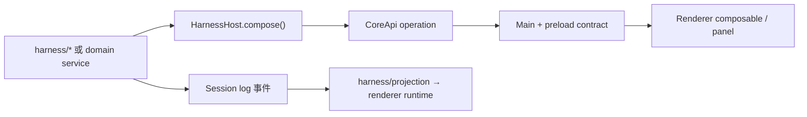

# 扩展 Emperor Agent

> 文档状态：Active 
> 面向读者：Core、Electron 与 renderer 开发者 
> 最后核验：2026-09-22 
> 事实源：`packages/core/src/harness/host/host.ts`、`packages/core/src/api/operations.ts`、`packages/core/src/harness/projection/`、`packages/core/src/llm/`、`packages/core/src/harness/tools/builtin/`、`desktop/src/renderer/src/components/settings/`

Emperor Agent 的扩展通常横跨内核、CoreApi、Electron contract、renderer 投影和文档。先确定权威状态属于哪里：会话内的一切属于 session log；长期数据属于对应的保留服务。然后从内核或服务向外接入，不要把策略散落到组件或 prompt 文案。

## 通用顺序

1. 定义用户入口、失败语义、权限和成熟度。
2. 确定权威状态：session log 事件，还是某个保留服务的文件。
3. 在 `packages/core/src/harness/<子系统>/` 或 `packages/core/src/<domain>/` 实现。
4. 在 `HarnessHost.compose()` 中组合（工具、prompt section、middleware）。
5. 需要界面调用时由 CoreApi 暴露最小 operation，并接入 validation 与 mutation guard。
6. 同步 Electron main contract、preload 和 renderer API。
7. 需要异步投影时扩展 projector 与 renderer runtime。
8. 加测试、诊断、用户文档、架构文档和 changelog。

```mermaid
flowchart LR
  Kernel["harness/* 或 domain service"] --> Host["HarnessHost.compose()"]
  Host --> CoreApi["CoreApi operation"]
  CoreApi --> IPC["Main + preload contract"]
  IPC --> UI["Renderer composable / panel"]
  Kernel --> Log["Session log 事件"]
  Log --> Projection["harness/projection → renderer runtime"]
```

## 新工具

1. 在 `packages/core/src/harness/tools/builtin/` 用 `defineTool({ name, description, input, execute })` 实现，`input` 是 zod schema。名称使用简短的小写蛇形（与现有 `bash`、`read`、`todo_write` 一致）。
2. 只有能证明无共享可变状态、无顺序依赖的工具才实现 `isConcurrencySafe`；其余调用会成为调度屏障。需要时设置 `timeoutMs`。
3. 执行体必须使用 `context.signal` 响应取消，把失败抛为 `ToolError`，由注册表转换为模型可读的错误结果；不要自己写 `tool/*` 事件。
4. 会写文件或执行命令的工具复用 `harness/sandbox/` 的策略：参数中加入 `escalationFields`，写入前用 `approveEscalation()` 处理一次性提权，受限模式无法执行时 fail closed。
5. 需要依赖的服务通过 `ToolServices`（`harness/tools/services.ts`）或工厂参数注入，不要在工具里 new 保留服务。
6. 在 `HarnessHost.compose()` 中 `tools.register(...)`；需要模型使用说明时用 `prompt.section({ name: 'tool:<name>', order, text })` 登记。
7. 结果大小交给 post-execute 的落盘 middleware；工具自身需要保存全文时使用 `spillText()`。
8. 同步 renderer 的工具展示（`components/conversation/tools/registry.ts`、`components/conversation/tools/toolModel.ts`）和 `components/icons/ds/` 图标。
9. 用 `harness/testing.ts` 的脚本化模型测试：正常完成、错误、取消、并发与屏障。

MCP 工具不需要注册代码：`McpToolBridge` 会把每个已连接 server 的工具注册为 `mcp_<server>_<tool>`。

### 修改应用配置的工具

修改的是 Emperor 自己的配置或数据（而不是 workspace 文件）时，参照 `skill_manage`（`harness/tools/builtin/skill-manage.ts`）和 `mcp_config`（`harness/tools/builtin/mcp-config.ts`）：

- 写入逻辑放在领域模块，与 CoreApi 服务共用（`skills/library.ts`、`mcp/manage.ts`），工具只做参数映射和结果格式化，不复制校验或合并规则。
- 审批跟随权限预设：通过工厂注入 `SandboxPolicyService` 与 `ApprovalService`，写入前按当前 session 的沙箱模式判断，`danger-full-access` 直接执行，其他模式调用 `ApprovalService.request({ agent, toolName, callId, reason, signal })`，只有 `allowed-once` 才继续；`rejected`、`cancelled`、`unavailable` 和缺少审批通道都抛出 `ToolError`。`reason` 写成用户能看懂的一句话，说明要改哪个文件或对象。
- 只读动作不询问，并用 `isConcurrencySafe` 放行；写入后触发对应刷新（Skill 目录变更通知、MCP 重载），让新状态从下一步起生效。
- 用 `prompt.section({ name: 'tool:<name>', ... })` 告诉模型只通过该工具修改这类配置，不要用文件或 Shell 工具绕过。

## 新 middleware 或内核子系统

- 扩展点定义在 `harness/agent/middleware.ts`（`preStep`、`requestConfig`、`requestError`、`turnStopping`）和 `ToolRegistry` 的 `preExecute` / `postExecute` / guard 数组。
- 在 `HarnessHost.compose()` 中按顺序压入。Pre-step 顺序有意义：工作区说明、记忆、Skill 目录、压缩、重复提醒、Hooks。
- 需要持久状态时，通过 `declare module '../../session-log/types'` 扩展 `SessionEventMap`，把事实写成 log 事件，而不是另建文件。
- 要进入模型上下文的动态信息使用上下文消息（`contextMessage`），只在内容变化时追加；不要修改系统提示词，以保持前缀缓存稳定。
- 需要在崩溃后收尾的交互，向 `SessionLogStore` 提供 repair contributor。

## 新 Provider 或模型字段

- Provider 访问方式登记在 `packages/core/src/llm/catalog.ts`：协议、默认 API Base、模型发现与 reasoning 适配。catalog 不内嵌模型清单。
- `packages/core/src/llm/route.ts` 的 `routeFromEntry()` 把 `model_config.json` 条目解析为 `RouteSpec`；选择传输适配器（`deepseek` 或 `pi-ai`）也在这里。新的线协议在 `llm/adapters/` 下实现。
- 模型配置契约是 schemaVersion 2：可以保存多个条目，但只有一个 `activeModelId`。修改 schema 时同步 `config/model-config.ts`、`api/services/model-service.ts`、`operations.ts` 中的 `model.*` schema 和 renderer 模型面板。
- 重试策略在 `llm/retry-policy.ts`，由 `harness/agent/retry.ts` 消费；适配器内部不做隐藏重试。
- 不在日志、runtime event、诊断或截图中暴露 API key。

## 新 CoreApi operation

- 在 `packages/core/src/api/operations.ts` 登记名称与 zod schema，在 `core-api.ts` 实现 handler；handler 只编排服务。
- 修改状态的 operation 调用 `assertMutation()`（待处理交互 409、Plan 模式 403）。
- 同步 main operation contract、preload 类型、renderer API 和 `desktop/src/main/core-host.test.ts`。
- 错误使用稳定 code 与安全消息，不回传堆栈、凭证或任意本机路径。下线的 operation 保留名称并抛出 `OperationRetiredError`。

## 新 Slash command 或 Skill 命令

- 内置命令只在 `packages/core/src/commands/builtins.ts` 声明 descriptor，执行分支在 `api/services/command-application-service.ts`。
- Renderer 只调用 `commands.list/complete/invoke`，提交 Core 返回的稳定 command ID。
- 必须明确忙碌策略（`immediate`、`after_turn`、`reject_when_busy`）和允许的调用来源。
- 动态 Prompt 命令通过 Skill frontmatter 声明，不新增 `/skill` 中转或 `.emperor/commands/`。
- 详见 [Slash command 平台](../architecture/slash-command-platform.md)。

## 新 Runtime event

- 来自 log 的事件：在 `harness/projection/projector.ts` 的折叠中产生，保证 live 与 replay 一致；host-only 事件通过 `HarnessHost.emitHost()` 发送，seq 为 0、不重放。
- 在 `harness/projection/wire-names.ts` 登记名称，renderer 通过 `@emperor/core/runtime-contract` 获得名单。
- 同步 renderer `types.ts`、`runtime/*` reducer / handler 和 `composables/useRuntime.ts`。
- Payload 有界且可序列化，不携带原始 prompt、secret 或未经筛选的工具输出。
- 测试 live、replay、bootstrap、重复事件和切换 session。

## 新 ACP method 或投影

- ACP 是同一 Core 的本机 stdio adapter，request handler 只调用 CoreApi，不复制会话、权限或工具逻辑。
- `initialize` 只声明已经通过 wire 与真实 Core E2E 的能力。
- client 路径先做绝对路径、realpath、既存目录校验；`mcpServers`、`additionalDirectories`、命令和模型选择不能从 wire 进入受信配置。
- 新投影走 `AcpEventProjector` 白名单，并定义字段、字节和事件数上限。
- 操作说明见 [Headless ACP operator preview](headless-acp.md)。

## Renderer Action / Effect

- Projection reducer 是纯函数：不读取时间、随机数、DOM、IPC、文件或网络，也不启动 Promise/timer。
- IPC、timer 等副作用只能由 effect executor 运行，结果以 `TaskResult` action 回到 reducer；相同 key 的新 effect 取消旧 effect。
- Replay 只做 projection 并返回空 effect。
- 每个领域维护自己的 action/effect 与 reducer，不要汇总成全局巨型 switch。

## 新持久化领域

- 会话范围的事实优先写成 session log 事件；只有跨会话的长期数据才新建文件。
- 私有数据写入 `stateRoot`，内置只读资源写入 `runtimeRoot`。
- 定义 schema 版本、原子写、文件权限、损坏时的 fail-closed 行为和兼容策略，并使用临时目录测试。
- 删除 session 或项目时处理所属数据与后台任务。

## 新面板或路由

- 先确认能力已有稳定 Core 入口。存在 store / service 不等于已经是用户产品。
- 遵循现有 view、panel、composable、API 和 runtime handler 分层；图标统一从 `desktop/src/renderer/src/icons.ts` 映射。
- UI 改动运行 `npm --prefix desktop run screenshots`，只保留有意更新的基线。

### 新设置分区

设置弹窗的分区列表在 `desktop/src/renderer/src/components/settings/settingsSections.ts`，分区组件在 `SettingsModal.vue` 的 `SECTION_BODIES` 中按 key 懒加载，每个分区一个 `<Name>Section.vue`。写法以 `components/settings/ui/index.ts` 顶部注释为准：

- 用 `components/settings/ui/` 的原语搭建：`SettingsSection`、`SettingsGroup`、`SettingsRow`、`SettingsCard`，表单控件包在 `Field` 里（`TextField`、`TextArea`、`CodeEditor`、`Select`、`Switch`、`Segmented`、`SearchField`），状态用 `StatusBadge` / `Metric` 和 `--state-*` token。开发模式下打开 `?settings-gallery` 可以查看全部原语。
- 弹窗外壳负责标题栏，分区内不要再渲染标题或操作栏。刷新、主要和次要操作通过 `settingsHeader.ts` 的 `useSettingsHeader({ actions })` 与 `refreshAction()` 注册到标题栏，下拉菜单用 action 的 `menu`；注册在组件卸载时自动移除。
- 新建或编辑优先在卡片内展开（参照模型、Scheduler 分区），确实需要对话框时使用 `ui/Modal`，Escape 只关闭最上层对话框。
- 新增分区 key 时同步 `settingsSections.ts`、`SECTION_BODIES`、`settingsIcons.ts` 和相关测试，以及用户手册中的设置分区表。

## 新后台能力

Scheduler、Watchlist 或 Goal 触发的 turn 必须：

- 通过 `HarnessHost.submit()` 进入目标 session 的 inbox，不写入当前前台 session；
- 使用与普通 turn 相同的权限预设、沙箱与审批；
- 有待处理交互时不自动开跑（Scheduler 的 `agent_turn` 会报错）；
- 重启后不自动重放可能已有副作用的工作；
- 提供暂停、取消或诊断中的至少一种可控失败路径。

Scheduler 的调度、misfire 与准入逻辑在 `packages/core/src/scheduler/service.ts`，执行器在 `harness/host/scheduler.ts`。

## 验收矩阵

| 检查面        | 最低要求                                              |
| ------------- | ----------------------------------------------------- |
| 类型与 schema | 静态类型和运行时输入校验一致                          |
| 权限          | 三种预设、一次性提权、Plan 模式与子代理均有覆盖       |
| 持久化        | 重启、崩溃修复、重复请求、损坏与迁移行为明确          |
| IPC           | Core、main、preload、renderer contract 同步           |
| Runtime       | live / replay / bootstrap 一致且按 session 隔离       |
| 安全          | 不泄露凭证，不信任 renderer / model / remote input    |
| 文档          | 用户入口、边界、架构与 Changelog 同步                 |
| 验证          | 相关测试、typecheck、lint、build 和 `make check` 通过 |

更细的事实源映射见[文档维护规范](../DOCUMENTATION.md)。
