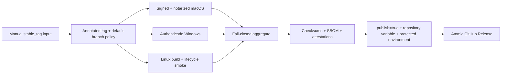

# Stable 受信发布手册

> 文档状态：Frozen 
> 面向读者：未来的发布维护者 
> 冻结说明：workflow 和验证链已保留，但当前公开渠道不是 Stable；Stable tag 不会自动触发，仓库变量 `EMPEROR_STABLE_RELEASE_ENABLED` 在解冻前必须保持未设置 
> 最后核验：2026-07-19 
> 事实源：`.github/workflows/release.yml`、`scripts/build_desktop_release.sh`、`scripts/verify-*-release.*`、`scripts/publish-release.sh`

本手册描述仓库中已存在但尚未作为当前公开渠道启用的受信发布链。不能因为 workflow 文件存在，就对外宣称已经提供 Stable 包。

## 启用门槛

- macOS Developer ID 证书与 App Store Connect API 凭证可用，arm64 / x64 均能签名并 notarize。
- Windows Azure Artifact Signing 配置、publisher 和服务凭证可用，NSIS 包通过 Authenticode 验证。
- Linux AppImage / DEB 在受支持 Ubuntu 矩阵完成安装、smoke 与移除。
- 三平台 candidate receipt、聚合 contract、checksum、SBOM 和 attestation 完整通过。
- 在非公开 tag 或受控演练中完成一次端到端候选验收，并由维护者明确解除 Frozen 状态。
- README、Security、Changelog 与 Release notes 已从 Preview 边界切换到 Stable 事实。

任一条件未满足时，继续使用[未签名 Preview 渠道](preview-release-runbook.md)。不得把 unsigned candidate 放进 Stable workflow，也不得删除签名校验以求通过。

## 手动触发与机器门禁

`.github/workflows/release.yml` 只接受 `workflow_dispatch`，推送任何 Stable tag 都不会自动运行。维护者必须显式输入现有 `stable_tag`；`release-policy` 会在任何候选 job 前验证：

- tag 只能是无 prerelease 后缀的 `v<major>.<minor>.<patch>`；
- tag 必须已经存在且是 annotated tag；
- tag 必须与其 commit 中 `desktop/package.json` 的版本一致；
- tag commit 必须位于默认分支历史中。

`publish=false` 只执行签名候选、smoke、receipt、SBOM 与 attestation 演练，不创建 GitHub Release。公开发布同时要求：

1. 手动输入 `publish=true`；
2. 仓库变量 `EMPEROR_STABLE_RELEASE_ENABLED` 明确设置为 `true`；
3. `stable-release` GitHub Environment 配置 required reviewers 并通过审批。

当前 Frozen 期间必须保持 `EMPEROR_STABLE_RELEASE_ENABLED` 未设置，即使误触手动 workflow 也不能进入 `publish-release`。解除冻结必须先按本手册完成候选演练，再通过单独 code review 同时变更仓库变量和 Environment 保护设置。

## 凭证

macOS job fail closed 地要求：

- `MACOS_CERTIFICATE`
- `MACOS_CERTIFICATE_PASSWORD`
- `APPLE_API_KEY_BASE64`
- `APPLE_API_KEY_ID`
- `APPLE_API_ISSUER`
- `APPLE_TEAM_ID`

Windows job fail closed 地要求：

- `WINDOWS_SIGNING_ENDPOINT`
- `WINDOWS_SIGNING_PROFILE`
- `WINDOWS_SIGNING_ACCOUNT`
- `WINDOWS_SIGNING_PUBLISHER`
- `AZURE_TENANT_ID`
- `AZURE_CLIENT_ID`
- `AZURE_CLIENT_SECRET`

凭证只进入 GitHub Actions secrets，不写入仓库、receipt、日志、SBOM 或安装资产。

## 候选与验证链

- macOS：构建签名候选，验证签名、notarization、DMG 和 packaged smoke；smoke 必须报告可用 `macos-seatbelt`。
- Windows：构建签名 NSIS，验证 Authenticode，并完成安装、smoke、卸载；在 Job Object + ACL backend 实现前必须报告 `windows-unsupported`，不能伪装 sandboxed。
- Linux：构建 AppImage / DEB，在 Ubuntu 22.04 / 24.04 验证完整生命周期，并记录 `linux-bwrap` 的真实 available/unavailable/error capability。
- 所有平台的 packaged smoke schema 2 必须显示 Lifecycle Supervisor 为 `ready`，全部 required service 为 ready，并由真实 ASAR renderer 证明 Node globals absent、Core bridge/bootstrap、attachment 字节、sandbox/context-isolation/node-integration 全部通过；缺项、failed、stop timeout 或非 Linux 平台关闭 Chromium sandbox 都不得进入聚合发布。
- Aggregate：只接受完整平台矩阵和 receipt，生成合并 SBOM 与 checksum，并上传 GitHub attestations。
- Publish：重新核验所有材料，先 draft、核对 inventory，再原子公开。

平台 build job 没有发布权限。唯一公开入口是通过 aggregate 后的 `publish-release` job。

## 启用时的最终验收

- [ ] 两个 macOS 架构均显示预期 Developer ID，notarization ticket 可验证。
- [ ] Windows EXE publisher 与 policy 中的 publisher 完全一致。
- [ ] Linux 两个 Ubuntu 版本的安装、smoke、移除 receipts 齐全。
- [ ] 所有资产通过 `SHA256SUMS.txt` 和 GitHub attestation 验证。
- [ ] SBOM 与发布 commit、lockfile 和资产 inventory 一致。
- [ ] GitHub Release 不是 Pre-release，且没有 `UNSIGNED` 标识。
- [ ] 从全新用户环境安装并完成模型配置、Chat 与 Build smoke。
- [ ] 回滚方案是撤下 Release 并发布新版本，不是原地替换同名二进制。

解除 Frozen 状态必须单独 code review，同时更新文档中心、README 和 Security 支持范围。
